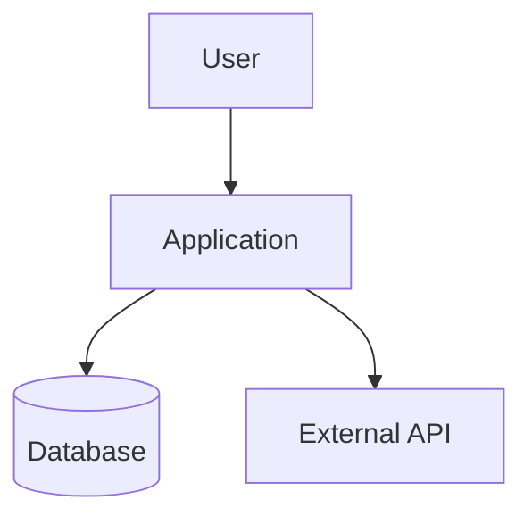

# Code Documentation Governance Skill

## Purpose

Use this skill whenever code is being committed, reviewed, merged, prepared for a pull request, prepared for handoff, or evaluated for production readiness.

The goal is to ensure that every code change is understandable, maintainable, secure, auditable, and properly documented according to professional software engineering, cybersecurity, compliance, and operational best practices.

This skill does not merely check whether comments exist. It determines whether the project has enough documentation for a qualified engineer, security reviewer, compliance reviewer, auditor, or future maintainer to understand:

- What changed
- Why it changed
- How the system works
- How to operate it
- How to troubleshoot it
- What risks exist
- What regulatory or compliance references apply
- What dependencies are used
- What error codes mean
- What handoff information is required
- What architectural decisions were made

## When to Use This Skill

Use this skill when the user asks to:

- Review code before commit
- Review staged changes
- Review a pull request
- Prepare code for GitHub
- Improve documentation
- Add missing documentation
- Create or update a /docs folder
- Create or update project handoff documentation
- Create or update an SBOM
- Document error codes
- Document regulatory references
- Document architecture
- Prepare a project for client delivery
- Prepare a project for internal engineering handoff
- Prepare a project for federal, regulated, enterprise, or security-sensitive use
- Make the repository more professional
- Make the repository easier for another developer or AI agent to understand

## Core Operating Rule

Before approving any commit, review both:

1. The code change itself
2. The documentation impact of the code change

A change is not complete if the code works but the documentation is stale, missing, misleading, or insufficient for handoff.

## Required Repository Documentation

Every serious repository should have a /docs folder. If the folder does not exist, create it.

At minimum, ensure the following documents exist under /docs:

```
/docs/
  ERROR_CODES.md
  HANDOFF.md
  PDR.md
  REGULATORY_REFRENCES.md
  SBOM.md
  TECHNICAL_ARCHITECTURE.md
```

**Important:** preserve the requested filename `REGULATORY_REFRENCES.md` even though "references" is misspelled. If appropriate, also create a correctly spelled redirect file:

```
/docs/REGULATORY_REFERENCES.md
```

The correctly spelled file should point back to the requested canonical file unless the user instructs otherwise.

Example:

```markdown
# Regulatory References

The canonical project file is:

- [REGULATORY_REFRENCES.md](./REGULATORY_REFRENCES.md)

This file exists to support correct spelling and searchability.
```


## Strongly Recommended Additional Documents

Evaluate whether the project should also include these documents:

```
README.md
CHANGELOG.md
CONTRIBUTING.md
CODE_OF_CONDUCT.md
SECURITY.md
LICENSE
/docs/ADR/
  0001-record-architecture-decisions.md
/docs/API.md
/docs/CONFIGURATION.md
/docs/DEPLOYMENT.md
/docs/DEVELOPMENT.md
/docs/OPERATIONS_RUNBOOK.md
/docs/INCIDENT_RESPONSE.md
/docs/THREAT_MODEL.md
/docs/DATA_MODEL.md
/docs/DATA_CLASSIFICATION.md
/docs/PRIVACY.md
/docs/COMPLIANCE_MATRIX.md
/docs/TESTING_STRATEGY.md
/docs/OBSERVABILITY.md
/docs/BACKUP_AND_RECOVERY.md
/docs/RELEASE_PROCESS.md
/docs/DEPENDENCY_MANAGEMENT.md
/docs/AI_USAGE.md
/docs/KNOWN_LIMITATIONS.md
```

Do not create unnecessary documentation just to create files. Create or recommend documents when the repository's purpose, risk level, production use, regulatory exposure, team size, or future handoff justifies them.

For cybersecurity, compliance, AI, healthcare, finance, identity, cloud infrastructure, critical infrastructure, or regulated-sector projects, bias toward more complete documentation.

## Documentation Review Principles

When reviewing code, verify that documentation is:

- Accurate
- Current
- Specific
- Actionable
- Maintainer-friendly
- Security-conscious
- Audit-friendly
- Free of misleading claims
- Free of secrets, tokens, private keys, passwords, customer data, or sensitive internal information
- Written in plain professional language
- Organized for fast onboarding
- Consistent with the actual codebase

Reject vague documentation such as:

- "Fix bug"
- "Updated logic"
- "Handles errors"
- "Security stuff"
- "TODO later"
- "Magic happens here"
- "Temporary workaround" with no explanation
- "Production ready" without evidence

Prefer clear documentation such as:

- What changed
- Why the change was needed
- What tradeoffs were accepted
- What assumptions were made
- How failures are handled
- How to test the behavior
- How to operate or roll back the change
- What risks remain


## Commit Review Workflow

When invoked, follow this process.

### Step 1 — Determine Repository Context

Inspect the repository structure. Identify:

- Primary language or languages
- Frameworks
- Package managers
- Build system
- Test framework
- Deployment target
- Whether this is an API, web app, CLI, library, automation, AI tool, data pipeline, infrastructure repo, or mixed project
- Whether /docs exists
- Whether required docs exist
- Whether documentation appears stale
- Whether security or compliance documentation is required

### Step 2 — Inspect Git State

Review the current change set. Use the safest available method, such as:

```bash
git status --short
git diff
git diff --staged
git log --oneline -n 10
```

If reviewing a pull request, inspect the PR diff and changed files.

Classify changed files by type:

- Source code
- Tests
- Configuration
- Infrastructure as code
- CI/CD
- API schema
- Database migration
- Security control
- Authentication or authorization
- Dependency or package update
- Documentation
- Generated file
- Build artifact

### Step 3 — Identify Documentation Impact

For every code change, ask:

- Does this change alter behavior?
- Does this change add, remove, or modify public APIs?
- Does this change introduce new error conditions?
- Does this change modify configuration?
- Does this change affect deployment?
- Does this change affect security?
- Does this change affect data handling?
- Does this change affect logging, monitoring, or alerting?
- Does this change affect regulatory posture?
- Does this change add dependencies?
- Does this change require SBOM updates?
- Does this change affect handoff instructions?
- Does this change alter architecture?
- Does this change require a new Architecture Decision Record?
- Does this change require updates to README or runbooks?

If yes, update the appropriate documentation.

### Step 4 — Review Inline Code Documentation

Review comments, docstrings, names, and structure. Require documentation for:

- Public functions
- Public classes
- API handlers
- Complex business logic
- Security-sensitive logic
- Cryptographic logic
- Authentication and authorization logic
- Error handling
- External service integrations
- Background jobs
- Data transformations
- Regulatory decision logic
- AI prompts or model orchestration
- Non-obvious performance optimizations
- Workarounds
- Feature flags
- Configuration values
- Environment variables

Do not require comments for obvious code. Bad comments are worse than no comments. Reject comments that merely repeat the code.

Bad:

```python
x = x + 1  # increment x
```

Better:

```python
# Retry budget is capped to prevent downstream API throttling during batch runs.
attempt_count += 1
```


### Step 5 — Review Tests and Test Documentation

Check whether changed behavior has tests. If tests are missing, recommend or add them when appropriate.

Documentation should explain:

- How to run tests
- Required test data
- External services that must be mocked
- Known flaky tests
- Coverage expectations
- Security test expectations
- Regression scenarios

Update or create `/docs/TESTING_STRATEGY.md` when the project has meaningful test complexity.

### Step 6 — Review Security Documentation

For security-sensitive code, check whether the documentation explains:

- Authentication model
- Authorization model
- Secret handling
- Input validation
- Output encoding
- Dependency risk
- Logging of sensitive data
- Data retention
- Encryption in transit
- Encryption at rest
- Threat model
- Abuse cases
- Rate limiting
- Audit logging
- Privilege boundaries
- Supply chain risks
- Secure deployment assumptions

Update or create `SECURITY.md`, `/docs/THREAT_MODEL.md`, `/docs/DATA_CLASSIFICATION.md`, and `/docs/INCIDENT_RESPONSE.md` when justified.

### Step 7 — Review Regulatory and Compliance Impact

For regulated or compliance-relevant systems, update `/docs/REGULATORY_REFRENCES.md` and `/docs/COMPLIANCE_MATRIX.md`.

Common references may include, depending on the project:

- NIST Cybersecurity Framework
- NIST SP 800-53
- NIST SP 800-171
- NIST SP 800-218 Secure Software Development Framework
- NIST AI Risk Management Framework
- CIS Critical Security Controls
- ISO/IEC 27001
- ISO/IEC 27002
- SOC 2 Trust Services Criteria
- HIPAA Security Rule
- PCI DSS
- GDPR
- CCPA / CPRA
- FedRAMP
- FISMA
- CMMC
- OWASP ASVS
- OWASP Top 10
- OWASP API Security Top 10
- CSA Cloud Controls Matrix
- DISA STIGs
- FAA, FDA, TTB, IRS, DHS, CISA, or sector-specific references when applicable

Do not claim compliance unless evidence exists. Use wording such as:

- "Supports alignment with..."
- "Relevant control family..."
- "Potentially applicable..."
- "Requires legal/compliance validation..."

Avoid unsupported claims such as:

- "This system is HIPAA compliant"
- "This project is FedRAMP certified"
- "This satisfies PCI"
- "This meets all NIST requirements"

### Step 8 — Review SBOM Impact

When dependencies change, update `/docs/SBOM.md`.

SBOM documentation should identify:

- Package ecosystem
- Dependency source
- Direct dependencies
- Notable transitive dependencies if available
- License concerns
- Known vulnerability review status
- SBOM generation command
- Date generated
- Tool used
- File hash if applicable
- Output artifact location

Prefer machine-readable SBOM output when tooling exists.

Recommended tools by ecosystem:

- JavaScript / TypeScript: npm audit, pnpm audit, yarn audit, CycloneDX npm tools
- Python: pip-audit, pipdeptree, CycloneDX Python tools
- Java: Maven/Gradle dependency plugins, OWASP Dependency-Check, CycloneDX Maven/Gradle
- .NET: dotnet list package --vulnerable, CycloneDX .NET
- Go: go list -m all, govulncheck, CycloneDX Go
- Rust: cargo audit, cargo tree
- Containers: Syft, Grype, Trivy
- General SBOM: CycloneDX or SPDX

If tools are unavailable, create a manual SBOM summary and note the limitation.


### Step 9 — Update Required Documents

Create or update each required document as described below.

## Required Document Standards

### /docs/ERROR_CODES.md

Purpose: provide a durable reference for error identifiers, failure modes, troubleshooting, and support handoff.

Required sections:

```markdown
# Error Codes

## Purpose
Explain what this document covers.

## Error Code Format
Describe the naming convention. Example format: DOMAIN-CATEGORY-NUMBER

Examples:
- API-AUTH-001
- DATA-VALIDATION-002
- JOB-TIMEOUT-003
- EXT-SERVICE-004

## Error Code Registry
| Code | Severity | Component | User Message | Internal Meaning | Common Cause | Recommended Action | Retryable | Owner |
|---|---|---|---|---|---|---|---|---|

## HTTP/API Error Mapping
| HTTP Status | Internal Code | Condition | Response Body | Notes |
|---|---|---|---|---|

## Logging Requirements
Explain what must be logged and what must not be logged.

## Troubleshooting Playbooks
Provide practical troubleshooting steps.

## Change Log
| Date | Change | Author |
|---|---|---|
```

Rules:

- Every new structured error must be added.
- Every user-facing error message must be safe and non-sensitive.
- Internal logs may contain diagnostic context but must not expose secrets.
- Retry behavior must be documented.
- Ownership must be clear.

### /docs/HANDOFF.md

Purpose: allow another engineer, operator, auditor, client, or AI coding agent to continue work without tribal knowledge.

Required sections:

```markdown
# Project Handoff

## Current Status
Summarize the project state honestly.

## What Changed Recently
List recent major changes.

## How to Run Locally
Include setup commands.

## How to Test
Include test commands and known test requirements.

## How to Build
Include build commands.

## How to Deploy
Describe deployment assumptions and commands.

## Required Environment Variables
| Variable | Purpose | Required | Example | Secret? |
|---|---|---|---|---|

## External Dependencies
List APIs, services, databases, queues, models, vendors, and cloud services.

## Known Issues
List unresolved defects, limitations, and risks.

## Operational Notes
Explain scheduled jobs, background workers, logs, monitoring, backups, and recovery steps.

## Security Notes
Explain secret handling, access requirements, auth model, and sensitive data concerns.

## Next Recommended Actions
Prioritized action list.

## Open Questions
Track unresolved decisions.

## Handoff Checklist
- [ ] Code builds
- [ ] Tests pass or failures documented
- [ ] Required docs updated
- [ ] Secrets removed
- [ ] Dependencies reviewed
- [ ] SBOM updated
- [ ] Error codes updated
- [ ] Architecture updated
- [ ] Regulatory references updated
```

Rules:

- Be blunt about incomplete work.
- Do not hide risks.
- Do not claim production readiness unless validated.
- Include enough detail for a new engineer to continue.


### /docs/PDR.md

Purpose: define the product or project direction.

Note: The filename PDR.md may mean "Product Definition Requirements," "Product Design Record," or "Project Decision Record." Unless the repository already defines the acronym, treat it as Product Definition Requirements.

Required sections:

```markdown
# Product Definition Requirements

## Purpose
Explain what this project does and why it exists.

## Problem Statement
Describe the user, business, operational, or compliance problem.

## Target Users
Identify primary and secondary users.

## Goals
List measurable goals.

## Non-Goals
Clarify what this project does not attempt to solve.

## Functional Requirements
| ID | Requirement | Priority | Status | Notes |
|---|---|---|---|---|

## Non-Functional Requirements
Include performance, reliability, security, privacy, usability, maintainability, and compliance requirements.

## User Workflows
Describe core workflows.

## Assumptions
List assumptions that influence design.

## Constraints
List technical, regulatory, budget, schedule, data, or operational constraints.

## Acceptance Criteria
Define what "done" means.

## Risks
| Risk | Likelihood | Impact | Mitigation | Owner |
|---|---|---|---|---|

## Open Questions
Track unresolved product decisions.

## Change Log
| Date | Change | Author |
|---|---|---|
```

Rules:

- Requirements must be testable where possible.
- Separate requirements from implementation details.
- Non-goals are mandatory to prevent scope creep.

### /docs/REGULATORY_REFRENCES.md

Purpose: identify regulatory, security, privacy, industry, or compliance frameworks that may apply.

Required sections:

```markdown
# Regulatory References

## Purpose
Explain that this document maps relevant frameworks and references. State that it is not legal advice.

## Applicability Summary
| Framework | Applies? | Why It May Apply | Validation Needed |
|---|---|---|---|

## Security and Software Development References
Include relevant security engineering references.

## Privacy and Data Protection References
Include privacy references if personal data is processed.

## Sector-Specific References
Include industry-specific references when applicable.

## Control Mapping
| Requirement / Control | Project Area | Current Support | Gap | Evidence |
|---|---|---|---|---|

## Evidence Locations
Link to tests, configs, logs, screenshots, policies, diagrams, or source files.

## Compliance Gaps
List known gaps.

## Review Cadence
Define how often this document should be reviewed.

## Change Log
| Date | Change | Author |
|---|---|---|
```

Rules:

- Never overstate compliance.
- Clearly separate "relevant reference" from "validated compliance."
- Include evidence links wherever possible.
- If the project has no obvious regulatory scope, say so and list general secure software references only.


### /docs/SBOM.md

Purpose: document software components, dependency risk, license concerns, and SBOM generation.

Required sections:

````markdown
# Software Bill of Materials

## Purpose
Explain what this SBOM covers.

## SBOM Summary
| Field | Value |
|---|---|
| Last Updated | YYYY-MM-DD |
| Tool Used | |
| SBOM Format | CycloneDX / SPDX / Manual |
| Scope | Application / Container / Infrastructure / Full Repository |
| Generated Artifact | |

## Dependency Ecosystems
| Ecosystem | Manifest File | Lock File | Package Manager |
|---|---|---|---|

## Direct Dependencies
| Name | Version | Ecosystem | Purpose | License | Source |
|---|---|---|---|---|---|

## Security Review
| Dependency | Version | Finding | Severity | Status | Notes |
|---|---|---|---|---|---|

## License Review
| Dependency | License | Concern | Action |
|---|---|---|---|

## SBOM Generation Commands
```bash
# Add commands here
```

## Known Limitations
Explain what is not covered.

## Change Log
| Date | Change | Author |
|---|---|---|
````

Rules:

- Update when dependencies change.
- Include lock files when available.
- Prefer generated SBOM artifacts over manual lists.
- Document tool limitations honestly.

### /docs/TECHNICAL_ARCHITECTURE.md

Purpose: explain how the system is structured and why.

Required sections:

````markdown
# Technical Architecture

## Executive Summary
Explain the system in plain English.

## System Context
Describe users, external systems, integrations, and trust boundaries.

## Architecture Diagram
Use Mermaid when possible.



## Major Components
| Component | Responsibility | Technology | Owner |
|---|---|---|---|

## Data Flow
Explain how data enters, moves through, and exits the system.

## Control Flow
Explain major runtime workflows.

## Trust Boundaries
Identify boundaries between users, services, networks, vendors, and data stores.

## Authentication and Authorization
Describe identity, access control, sessions, tokens, and permissions.

## Configuration
Describe environment variables, config files, secrets, and runtime settings.

## Deployment Architecture
Describe where and how the system runs.

## Storage Architecture
Describe databases, object storage, local files, queues, caches, and retention.

## Error Handling
Link to ERROR_CODES.md.

## Observability
Describe logging, metrics, tracing, dashboards, and alerts.

## Security Architecture
Describe security controls.

## Scalability and Performance
Describe known limits and scaling approach.

## Architecture Decisions
Link to ADRs where applicable.

## Known Technical Debt
List technical compromises and risks.

## Change Log
| Date | Change | Author |
|---|---|---|
````

Rules:

- Update when major components, dependencies, APIs, deployment, data flow, or security boundaries change.
- Include diagrams when they improve clarity.
- Do not allow architecture docs to drift from the code.


## Additional Best-Practice Documents

Create or recommend these when applicable.

### README.md
Required for almost every repository. Should include: project name, purpose, quick start, installation, usage, configuration, testing, documentation links, security contact, license.

### SECURITY.md
Required for public, enterprise, cybersecurity, SaaS, API, AI, cloud, or regulated projects. Should include: supported versions, vulnerability reporting process, security expectations, secret handling, disclosure policy, security contacts, dependency review process.

### /docs/THREAT_MODEL.md
Required for security-sensitive systems. Should include: assets, actors, trust boundaries, attack surfaces, abuse cases, STRIDE or similar analysis, mitigations, residual risk.

### /docs/API.md
Required when APIs exist. Should include: endpoints, request/response examples, authentication, authorization, error responses, rate limits, versioning, deprecation policy.

### /docs/CONFIGURATION.md
Required when environment variables, config files, feature flags, or deployment profiles exist. Should include: variable names, purpose, required/optional, defaults, example values, secret classification, production notes.

### /docs/DEPLOYMENT.md
Required for deployable systems. Should include: environments, deployment steps, rollback steps, required secrets, database migrations, health checks, post-deployment verification.

### /docs/OPERATIONS_RUNBOOK.md
Required for production or long-running systems. Should include: startup, shutdown, logs, alerts, common failures, recovery steps, escalation path, backup/restore.

### /docs/ADR/
Required when architectural decisions matter. Each ADR should include:

```markdown
# ADR-0001: Decision Title

## Status
Proposed / Accepted / Superseded

## Context
What problem forced this decision?

## Decision
What decision was made?

## Consequences
What tradeoffs were accepted?

## Alternatives Considered
What else was considered?

## Date
YYYY-MM-DD
```

### /docs/OBSERVABILITY.md
Required for production services. Should include: logs, metrics, traces, dashboards, alerts, SLOs, health checks, audit events.

### /docs/INCIDENT_RESPONSE.md
Required for enterprise, customer-facing, security, regulated, or production systems. Should include: incident severity levels, response roles, triage steps, containment, eradication, recovery, evidence preservation, notification requirements, post-incident review.

### /docs/AI_USAGE.md
Required when AI models, prompts, agents, LLMs, embeddings, or AI-generated outputs are used. Should include: model names, use cases, prompt locations, human review requirements, data sent to models, privacy risks, hallucination controls, evaluation process, safety constraints, logging and retention.

## Code Documentation Standards by Area

### Functions and Methods

Public or complex functions should document: purpose, inputs, outputs, exceptions or errors, side effects, security implications if applicable.

Example:

```python
def validate_label_payload(payload: dict) -> ValidationResult:
    """
    Validates an incoming label payload before OCR and compliance analysis.

    Args:
        payload: Parsed request body containing label metadata and file references.

    Returns:
        ValidationResult containing normalized fields and validation errors.

    Raises:
        PayloadValidationError: Raised when required fields are missing or malformed.

    Security:
        This function must not trust client-provided MIME types. File type validation
        must be performed using server-side inspection before downstream processing.
    """
```

### APIs
API handlers should document: route purpose, auth requirement, request schema, response schema, error codes, rate limits, side effects.

### Configuration
Every new environment variable must be documented in `/docs/CONFIGURATION.md` and `/docs/HANDOFF.md`. Minimum fields: Name, Purpose, Required?, Default, Example, Secret?, Used by, Production notes.

### Errors
Every new structured error must be documented in `/docs/ERROR_CODES.md`. Minimum fields: Code, User-safe message, Internal meaning, Cause, Resolution, Retryable?, Owner.

### Logging
Logging documentation must explain: what is logged, log levels, correlation IDs, audit events, sensitive fields that must never be logged, retention assumptions.

Reject code that logs: passwords, API keys, OAuth tokens, session tokens, private keys, full credit card numbers, full SSNs, protected health information unless explicitly authorized and protected, sensitive customer data without masking.

### Comments
Require comments for: non-obvious decisions, business rules, security-sensitive conditions, compliance logic, dangerous operations, external API assumptions, temporary workarounds, performance optimizations, race condition handling, concurrency logic. Do not add comments that repeat obvious code.

### TODOs
Every TODO must include: clear action, owner or team, reason, risk if not completed, optional ticket reference.

Bad:

```
TODO fix this
```

Good:

```
TODO(security): Replace temporary allowlist with policy-based authorization before
production release. Risk: overly broad access if this endpoint is exposed externally.
Ticket: SEC-142.
```


## Review Output Format

After reviewing code and documentation, produce a concise but complete report. Use this format:

```markdown
# Code Documentation Governance Review

## Verdict
Approved / Approved with Required Fixes / Not Ready

## Summary
Briefly summarize the review.

## Changed Code Reviewed
List major changed files or areas.

## Documentation Status
| Document | Status | Action |
|---|---|---|
| ERROR_CODES.md | Present / Missing / Updated / Needs Update | |
| HANDOFF.md | Present / Missing / Updated / Needs Update | |
| PDR.md | Present / Missing / Updated / Needs Update | |
| REGULATORY_REFRENCES.md | Present / Missing / Updated / Needs Update | |
| SBOM.md | Present / Missing / Updated / Needs Update | |
| TECHNICAL_ARCHITECTURE.md | Present / Missing / Updated / Needs Update | |

## Required Fixes Before Commit
List blockers.

## Recommended Improvements
List non-blocking improvements.

## Documentation Added or Updated
List files changed.

## Security and Compliance Notes
Include relevant risks, gaps, or confirmations.

## SBOM / Dependency Notes
Summarize dependency changes and SBOM status.

## Handoff Notes
Summarize what the next maintainer needs to know.

## Final Commit Readiness
State whether the code is ready to commit.
```

## Verdict Rules

Use **Approved** only when:

- Code documentation is adequate
- Required docs exist
- Changed behavior is reflected in docs
- SBOM impact is addressed
- Error codes are documented
- Handoff notes are current
- Architecture docs are current
- No material security or compliance documentation gaps remain

Use **Approved with Required Fixes** when:

- The code is mostly acceptable
- Documentation gaps are limited and fixable
- Specific required changes are listed

Use **Not Ready** when:

- Required docs are missing
- Architecture is unclear
- Security-sensitive behavior is undocumented
- Error handling is undocumented
- Dependencies changed without SBOM update
- Regulatory claims are unsupported
- Handoff is insufficient
- The code cannot be responsibly maintained by another engineer

## Automation Behavior

When allowed to edit files, perform these actions:

1. Create /docs if missing.
2. Create missing required docs using the templates above.
3. Update existing docs to reflect the code changes.
4. Do not overwrite valuable existing content.
5. Preserve user-authored context.
6. Add "Unknown" or "TBD" only when necessary, and explain the gap.
7. Prefer accurate partial documentation over fake completeness.
8. Add links between related documents.
9. Keep docs in Markdown.
10. Keep language professional, direct, and audit-friendly.

## Required Cross-Links

Add these references when appropriate:

- HANDOFF.md should link to all major docs.
- TECHNICAL_ARCHITECTURE.md should link to ERROR_CODES.md, SBOM.md, CONFIGURATION.md, DEPLOYMENT.md, and ADRs.
- REGULATORY_REFRENCES.md should link to evidence locations.
- SBOM.md should link to dependency manifests.
- ERROR_CODES.md should link to API documentation or runbooks when applicable.
- README.md should link to the /docs folder.

## Commit Message Guidance

When documentation is added or updated, recommend a commit message using conventional commit style where possible.

Examples:

```
docs: add code documentation governance baseline
docs: update architecture and handoff notes
docs: add SBOM and error code registry
chore: update dependency documentation and SBOM
docs(security): add threat model and regulatory references
```

For mixed code and docs:

```
feat(api): add label validation workflow with error documentation
fix(auth): handle expired token errors and update error registry
```

## Final Safety and Quality Checks

Before declaring the repository ready, verify:

- No secrets are present in docs
- No fake compliance claims are made
- No generated SBOM is claimed if it was not generated
- No architecture diagram contradicts the code
- No handoff file claims tests pass unless tests were run or evidence exists
- No regulatory framework is marked applicable without a reason
- No dependency risk is ignored
- No public API changed without documentation
- No new error path lacks an error code or troubleshooting note
- No environment variable is undocumented
- No operational behavior is hidden in code only

Be direct. If the repository is not ready, say so clearly and explain exactly what must be fixed.
