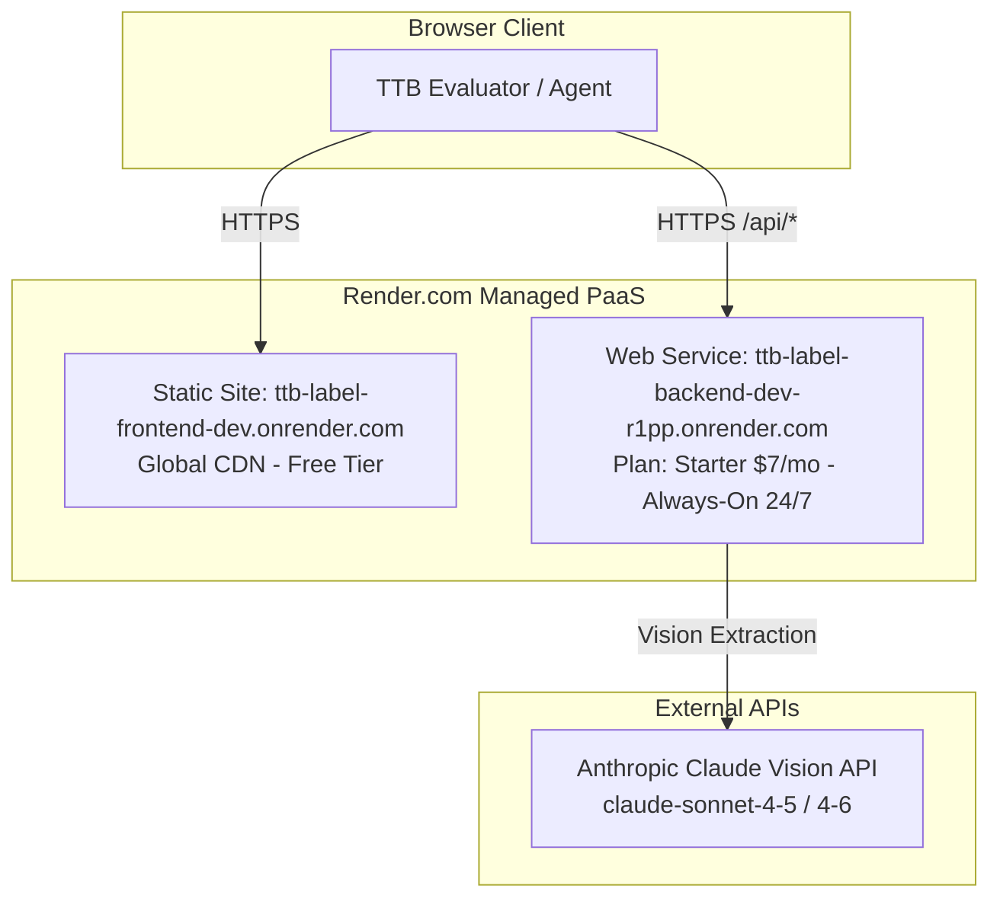

# Always-On Hosting Evaluation & Architecture Strategy
**TTB Label Compliance Review Tool**

**Document Version:** 1.0.0  
**Date:** September 2026  
**Status:** Architecture Strategy & Hosting Decision Guide (No Immediate Runtime Code Changes)  
**Target Environments:** Development (`ttb-label-backend-dev`, `ttb-label-frontend-dev`) & Production Promotion Path  
**Canonical Source of Truth:** `docs/ALWAYS_ON_HOSTING.md`  
**Related Documents:** [HANDOFF.md](./HANDOFF.md), [DEPLOYMENT.md](./DEPLOYMENT.md), [CONFIGURATION.md](./CONFIGURATION.md), [TECHNICAL_ARCHITECTURE.md](./TECHNICAL_ARCHITECTURE.md), [SECURITY_REVIEW_2026-09-16.md](./SECURITY_REVIEW_2026-09-16.md).

---

## Executive Summary

The **TTB Label Compliance Review Tool** is currently deployed as a decoupled FastAPI backend and React/Vite frontend on Render's free tier (`render.yaml`). Under Render's free tier, backend instances automatically spin down to zero after 15 minutes of inactivity. When a subsequent request arrives, cold-start latency ranges between **30 to 60 seconds** while the Python runtime initializes.

To keep the service responsive for evaluators and internal testing, an interim automated agent keep-alive routine (e.g. Grok-Bot waking every ~10 minutes) was introduced. However, relying on continuous agent wake loops creates recurring agent credit/token consumption, risks token exhaustion, and introduces unnecessary operational brittleness.

This document formally evaluates three primary hosting pathways to transition the TTB Label Compliance Review Tool to an **always-on, low-latency** posture without burning autonomous agent wakes:

1. **Status Quo (Render Free Tier + Grok-Bot Keep-Alive Routine)**
2. **Paid Render Always-On Architecture (Starter Web Service + Static Site)**
3. **Homelab Always-On Architecture (Docker Compose / AI-OS Stack on Proxmox / RAID10)**

It defines concrete operational trade-offs, financial costs, migration runbooks, secret handling governance, a definitive recommendation, and clear acceptance criteria.

---

## Hosting Options Comparison Matrix

| Dimension | Option 1: Status Quo (Render Free + Grok Keep-Alive) | Option 2: Paid Render (Starter Always-On) | Option 3: Homelab Always-On (AI-OS / Proxmox) |
|---|---|---|---|
| **Direct Hosting Cost** | \$0.00 / month (Render free) | **~\$7.00 / month** (Render Starter Backend) | \$0.00 incremental cloud cost (Self-hosted) |
| **Agent / Token Overhead** | **High** (~144 agent wake cycles/day; burns Grok credits) | **Zero** (native always-on instance) | **Zero** (native always-on container) |
| **P95 Health Response** | 30s–60s (if cold) / ~200ms (if kept warm) | **< 200 ms (Warm p95 < 2s guaranteed)** | **< 50 ms (Local/Direct) or < 200 ms (Tunnel)** |
| **Operational Complexity** | Medium (Monitoring keep-alive cron & wake agent state) | **Extremely Low** (Managed PaaS, blueprint push) | Medium–High (Docker daemon, ingress, backups) |
| **Evaluator Public Access** | Public URL (`*.onrender.com`), Fail-Open | Public URL (`*.onrender.com`), Fail-Open | Requires Tunnel/Ingress (Cloudflare / Tailscale) |
| **Accidental Gating Risk** | None (public endpoint) | None (public endpoint) | **Medium** (Risk of auth wall if CF Access/Tailscale misconfigured) |
| **Secrets Management** | Render Environment Secrets (`sync: false`) | Render Environment Secrets (`sync: false`) | Infisical / Docker Secrets / `.env` file |
| **Storage & Backup** | Stateless (Render ephemeral) | Stateless (Render ephemeral) | Stateless app + Proxmox/RAID10 backup for configs |
| **Recommendation** | **Retire** (Wasteful agent wake consumption) | **Primary Recommendation (Speed to Value)** | **Secondary Option (Coordinate with AI-OS)** |

---

## 1. Option 1: Status Quo (Render Free Tier + Agent Keep-Alive)

### Operational Architecture
- **Infrastructure:** Render free tier web service (`plan: free` in `render.yaml`) hosting FastAPI (`backend/app/main.py`) and a static frontend site (`frontend/`).
- **Spin-Down Behavior:** Automatically spins down to 0 replicas after 15 minutes of zero inbound HTTP traffic.
- **Warm-Up Mechanism:** Grok-Bot agent or external cron fires an HTTP `GET /api/health` ping every ~10 minutes.
- **Client Handling:** `frontend/src/api.ts` (`wakeServerIfNeeded()`) executes an upfront check and displays cold-start wake copy in `ProcessingStatusBar.tsx` ("Server is waking up... 15–30s").

### Cost & Resource Profile
- **Financial Cost:** \$0 / month on Render.
- **Agent Consumption:** ~6 pings/hour $\times$ 24 hours = **144 agent wake cycles per day** (~4,320 cycles/month). If an autonomous AI agent or workflow scheduler executes this routine, it consumes rate limits, token quotas, and active session slots.
- **Latency Penalty:** If the keep-alive ping slips or fails (e.g. transient network blip, scheduler sleep), the next evaluator request encounters a 30–60 second cold-start delay.

### Key Risks
1. **Agent Resource Burn:** Wasting agent tokens and execution quota on trivial HTTP ping loops.
2. **Brittle Uptime:** A single scheduler failure allows Render to idle the pod.
3. **Log Noise:** Health check pings clutter audit trails and rate-limit logs.

---

## 2. Option 2: Paid Render (Starter Always-On Web Service) — *Primary Recommendation*

### Operational Architecture
- **Infrastructure:** Upgrade backend service `ttb-label-backend-dev` (and production counterpart `ttb-label-backend`) from `plan: free` to `plan: starter` in `render.yaml` or via the Render dashboard.
- **Resource Allocation:** 0.5 CPU, 512 MB RAM (standard Starter tier), \$7/month per web service.
- **Frontend Hosting:** Remains on Render Static Site ($0/month, free unlimited bandwidth & global CDN).
- **Zero Spin-Down:** Web instances run 24/7/365 without sleep cycles or cold starts.



### Financial Cost Analysis
- **Backend Web Service (Starter Plan):** **\$7.00 USD / month** (~$0.23 / day).
- **Frontend Static Site:** **\$0.00 / month** (Render static sites have no monthly fee).
- **Anthropic Claude Vision API:** Billed purely on demand per label review (~$0.015–$0.030 per single review; $0 for `/api/health`).
- **Total Infrastructure Cost:** **\$7.00 / month**.

### Key Advantages
1. **Speed to Value:** Zero architecture refactoring; changing `plan: starter` in `render.yaml` and committing or clicking in Render Dashboard immediately takes effect.
2. **Native Always-On:** `p95` `/api/health` response times consistently **< 200 ms**; eliminating the need for `wakeServerIfNeeded` delays.
3. **Public Fail-Open Accessibility:** Retains clean, public `https://ttb-label-*.onrender.com` URLs with automated SSL certificates, ensuring TTB evaluators are never blocked by firewall or VPN requirements.
4. **Zero Ops Overhead:** No Linux host patching, container networking, reverse proxy renewal, or dynamic DNS maintenance.

---

## 3. Option 3: Homelab Always-On Architecture (AI-OS / Proxmox Stack)

### Operational Architecture
- **Infrastructure:** Dedicated Docker container running on Kilroy's on-premises Homelab virtual machine (e.g. Ubuntu 24.04 LTS under Proxmox VE).
- **Compute & Storage:** Co-located on existing hardware backed by the 24TB RAID10 storage array for configuration and state backup.
- **Containerization:** Multi-stage Docker build packaging FastAPI (`backend/`) and serving the built React static assets (`frontend/dist`) via Nginx or Caddy reverse proxy, or running as separate compose services.

```mermaid
flowchart TD
    subgraph Internet [Public Internet / Evaluators]
        PublicEvaluator[TTB Evaluator Browser]
        InternalAgent[Homelab AI-OS / Local Agent]
    end

    subgraph HomelabHost [Homelab Proxmox VM / Docker Host]
        subgraph Ingress [Ingress Gateway]
            Tunnel[Cloudflare Tunnel / Caddy Reverse Proxy<br/>Fail-Open Public Route]
        end
        subgraph AppStack [Docker Compose Stack]
            Web[Frontend / Nginx Reverse Proxy :80]
            App[FastAPI Backend :8000]
        end
        subgraph Storage [Proxmox / 24TB RAID10]
            Backup[Config & Environment Backup Volume]
        end
    end

    subgraph CloudAPI [External Anthropic API]
        AnthropicAPI[Anthropic Claude API]
    end

    PublicEvaluator -->|HTTPS (Fail-Open / Zero Auth Wall)| Tunnel
    InternalAgent -->|Local LAN / Tailscale| Web
    Tunnel --> Web
    Web --> App
    App -->|Vision Extraction| AnthropicAPI
    App -.->|Env Backup| Backup
```

### Ingress & Accessibility Constraints (Crucial: Preserve Fail-Open Access)
- **Zero Login Wall Requirement:** By explicit system design, the TTB review tool must maintain **fail-open public evaluator access**.
- **Cloudflare Tunnel (Cloudflared) / Reverse Proxy:** If exposing via Cloudflare Tunnel, public DNS routes (e.g. `ttb-dev.homelab.domain`) must be configured **without Cloudflare Access login gates or Zero Trust identity challenges**.
- **Tailscale Option:** Tailscale Serve / Funnel can be used. If Tailscale Funnel is enabled, verify it does not require client Tailscale nodes.
- **Fail-Safe Warning:** *Never place this service behind internal-only subnet routing or mandatory SSO unless Kilroy explicitly chooses to gate evaluator access.*

### Backup & Disaster Recovery Note
- The application itself is strictly stateless (per NFR-2 in `docs/PDR.md`; no images or extracted label data are persisted to disk).
- **Proxmox / 24TB RAID10 Storage Role:**
  - Used for automated nightly snapshot backups of Docker Compose configurations, `.env` deployment definitions, and Infisical secret export templates.
  - Snapshot retention: 7 daily, 4 weekly snapshots on the RAID10 ZFS/LVM pool.

---

## 4. Kill-Switch for Grok-Bot Keep-Alive Routine

Once an always-on deployment (Paid Render Starter or Homelab) is active, the Grok-Bot keep-alive routine **must be deactivated immediately** to halt unnecessary wake cycles and API usage.

### Deactivation Steps
1. **Disable Keep-Alive Scheduler:**
   - Pause or delete the 10-minute ping job in the Grok-Bot / external monitoring cron configuration.
   - Deactivate any automated agent task targeting `GET /api/health`.
2. **Verify Pod Warm Status:**
   - Run 3 consecutive test requests against `/api/health` spaced 20 minutes apart without any intermediate pings.
   - Confirm response latency remains `< 500 ms` without wake delay.
3. **Retain Client-Side Safety Net:**
   - The frontend's `wakeServerIfNeeded()` function in `frontend/src/api.ts` is non-destructive: when the server responds in `< 3000 ms`, it resolves as `"warm"` in milliseconds without blocking the UI. It will remain in place as a zero-cost fallback.

---

## 5. Secrets Management & Configuration Integrity

The TTB review tool requires runtime secrets and feature toggles. Regardless of the chosen hosting platform, the following configuration rules are mandatory:

### Environment Variable Registry

| Variable Name | Required | Secret? | Destination / Storage | Description & Invariant |
|---|---|---|---|---|
| `ANTHROPIC_API_KEY` | **Yes** | **YES** | Render Dashboard (`sync: false`) or Infisical / `.env` | Anthropic API key for Claude vision extraction. **Never commit to git.** |
| `CLAUDE_MODEL` | No | No | `render.yaml` or Docker env | Vision model override (Default: `claude-sonnet-4-5`; Render default: `claude-sonnet-4-6`). |
| `USE_FAST_EXTRACTION` | No | No | `render.yaml` or Docker env | **Must stay `false`** (OFF) on production and default dev deployments to preserve Sonnet accuracy. |
| `EXTRACTION_FAST_MODEL` | No | No | `render.yaml` or Docker env | Fast model identifier (`claude-3-5-haiku-latest`) used only when flag is enabled. |
| `CORS_ORIGINS` | No | No | Render Dashboard (`sync: false`) or Docker env | Allowed browser origins. Defaults fail-open to `*` for evaluator previews. |
| `DEMO_ACCESS_TOKEN` | No | **YES** | Render Dashboard (`sync: false`) or Infisical | **Must remain UNSET** for public evaluator demos to prevent login barriers. |
| `RATE_LIMIT_REVIEW` | No | No | Environment | Soft IP rate limit on review endpoints (Default: `20/minute`). |
| `MAX_CONCURRENT_CLAUDE_CALLS`| No | No | Environment | Concurrency semaphore capacity (Default: `5`). |
| `CLAUDE_CONCURRENCY_TIMEOUT` | No | No | Environment | Concurrency timeout seconds (Default: `30.0`). |
| `MAX_REVIEW_REQUESTS_PER_DAY` | No | No | Environment | Daily soft spend guard volume threshold (Default: `0` = disabled). |

### Strict Invariants
1. **`USE_FAST_EXTRACTION` Stays OFF (`false`):** High-accuracy regulatory checks (27 CFR Parts 4, 5, 7, 16) require full Sonnet visual acuity. Fast extraction is strictly opt-in for rapid `-dev` testing.
2. **Zero Login Wall / Fail-Open Invariant:** `DEMO_ACCESS_TOKEN` must remain unset in live hosting unless an evaluator access gate is explicitly requested by Kilroy.
3. **Secret Isolation:** Secrets must never be committed to repository files or build artifacts.

---

## 6. Concrete Recommendation & Decision Framework

### Recommendation: **Option 2 (Paid Render Starter Tier)**

**Rationale:**
1. **Immediate Speed-to-Value:** Upgrading `plan: free` $\rightarrow$ `plan: starter` in Render requires zero code refactoring, zero networking reconfiguration, and zero local hardware maintenance.
2. **Low Cost / High Return:** At **\$7.00 / month**, the cost is trivial compared to the engineering and agent quota spent managing and debugging cron wake agents.
3. **Reliable Fail-Open Public Access:** Render provides managed global CDN, automated Let's Encrypt SSL, and public high-bandwidth endpoints accessible to TTB evaluators without homelab firewall dependencies.
4. **Homelab as Step 2 (Optional):** If Kilroy prefers full homelab self-hosting or wishes to integrate the review tool into the larger AI-OS stack, homelab deployment can be coordinated as a planned follow-up without blocking immediate always-on responsiveness.

---

## 7. Acceptance Criteria Checklist

Before declaring the always-on hosting transition complete, verify the following:

- [ ] **Health Check Latency:** `GET /api/health` returns HTTP 200 with `p95` response time **< 2.0s** (target < 300ms) after 30+ minutes of idle time.
- [ ] **No Login Wall:** Accessing the frontend web application opens directly to Single Review / Label-Only Check without any basic auth, password gate, or Cloudflare Access challenge.
- [ ] **Sonnet Extraction Fidelity:** `USE_FAST_EXTRACTION` is confirmed `false` (`CLAUDE_MODEL=claude-sonnet-4-6` or `claude-sonnet-4-5`).
- [ ] **Grok Keep-Alive Kill-Switch:** Autonomous keep-alive wake routine is disabled; zero recurring agent pings in server access logs.
- [ ] **Secrets Integrity:** `ANTHROPIC_API_KEY` is securely injected via Render / Infisical environment configuration with no secrets stored in code or repository history.
- [ ] **CORS & Rate Limiting:** CORS continues to allow evaluator frontend origins; rate limiting returns HTTP 429 upon abuse (never 401).

---

## Open Questions for Kilroy

1. **Budget Approval:** Is the **~\$7.00 / month** Render Starter web service plan approved for immediate activation to keep the backend warm 24/7?
2. **Homelab Preference:** Would you prefer to prioritize complete self-hosted ownership on your Proxmox/Docker Homelab stack (coordinating with AI-OS Homelab), or proceed with Paid Render for speed-to-value and zero maintenance?
3. **Access Gating Intent:** Do you wish to keep public fail-open access active indefinitely for evaluator convenience, or should we plan a formal demo gate schedule?
