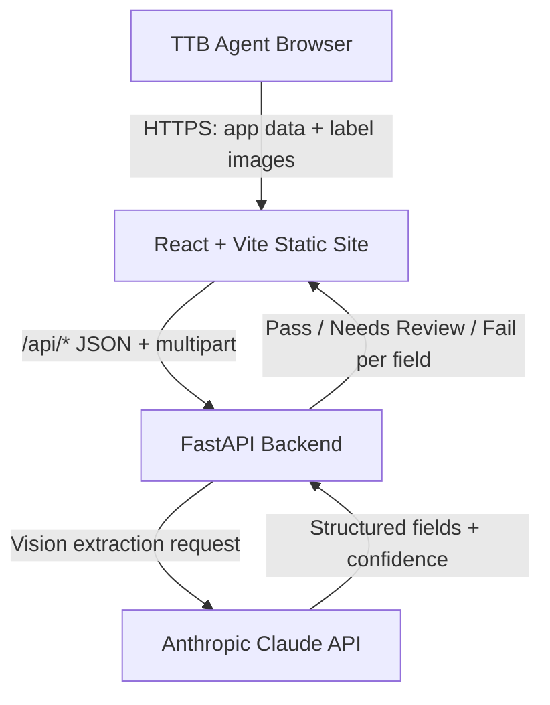

# Technical Architecture

> Generated as part of the code-documentation-governance skill. This document describes the system as implemented in this repository. It is a working reference, not a guarantee of production readiness; see [HANDOFF.md](./HANDOFF.md) for current status and known issues.

## Executive Summary

The TTB Label Compliance Review Tool is a prototype web application that helps TTB compliance agents check whether the text on an alcohol beverage label matches the corresponding COLA application data, and whether mandatory statements (notably the Government Warning) are present and correctly worded.

An agent enters application data and/or uploads label photos. A FastAPI backend sends the image(s) to Claude (vision) to transcribe structured label fields, then applies compliance-aware matching rules and returns a Pass / Needs Review / Fail result per field with a plain-language explanation and CFR citations. The system is stateless: nothing is persisted.

## System Context

- **Primary users:** TTB compliance agents reviewing COLA applications and labels.
- **External systems:** the Anthropic API (Claude vision model) for OCR/field extraction.
- **Hosting:** Render (a backend web service and a static frontend site), defined via a `render.yaml` blueprint.
- **Trust boundaries:** the browser (untrusted user input and uploaded images), the backend service (holds the Anthropic API key), and the Anthropic API (third-party processor of uploaded label images).

## Architecture Diagram

## Major Components

| Component | Responsibility | Technology | Location |
|---|---|---|---|
| Frontend UI | Data entry, image upload, results display, CSV export | React + TypeScript + Vite + Tailwind | `frontend/` |
| API client | Calls backend endpoints, retries, cold-start wake | TypeScript (`api.ts`, `safeFetch`) | `frontend/src/` |
| API layer | HTTP endpoints, request handling, streaming | FastAPI (`app/main.py`) | `backend/` |
| Extraction client | Sends images to Claude, parses structured output, image preprocessing | Anthropic SDK (`app/claude_client.py`) | `backend/` |
| Compliance engine | Field matching, tolerances, CFR checks, confidence gating | Python (`app/compliance.py`) | `backend/` |
| Data models | Request/response schemas | Pydantic (`app/models.py`) | `backend/` |

## Data Flow

1. The agent enters application data (single or batch) and/or uploads one to four label images per label.
2. The frontend sends the data to the backend via `/api/*` endpoints (JSON plus multipart image uploads). Images are resized client-side (to ~2048px) before upload.
3. The backend passes the image(s) to Claude with an extraction tool schema. When multiple photos have distinct roles (e.g. front/back), each is extracted independently and merged.
4. Claude returns structured fields plus an `extraction_confidence` score (and per-field confidence).
5. The compliance engine gates on confidence, then applies matching rules and CFR checks, producing a Pass / Needs Review / Fail per field.
6. The frontend renders results with side-by-side application-vs-label values, confidence badges, a zoomable image viewer, and CSV export for batches.

No application data or images are stored server-side; each request is stateless.

## Control Flow

- **Single review:** one label + application data -> one Claude call -> compliance checks -> result.
- **Batch review:** multiple labels submitted together; a streaming endpoint (`/api/review/batch/stream`, NDJSON) reports per-label progress live.
- **Label-only check:** label image(s) with no application data, validated against TTB mandatory label requirements (27 CFR Parts 4, 5, 7, and 16). When beverage type is ambiguous, the response sets `needs_beverage_confirmation` and the UI prompts the agent to confirm before evaluating.

## Trust Boundaries

- **Browser -> Backend:** all uploaded images and typed data are untrusted input. File type should be validated server-side rather than trusting client MIME types.
- **Backend -> Anthropic API:** label images leave the trust boundary and are processed by a third party. Relevant to privacy and to any outbound-egress firewall constraints noted for production.
- **Secret boundary:** the Anthropic API key lives only in the backend service environment; it is never exposed to the browser.

## Authentication, Rate Limiting, and Guardrails

The prototype implements a **fail-open security and abuse prevention architecture**:

1. **Fail-open demo gate**: When `DEMO_ACCESS_TOKEN` is unset in the environment, all requests proceed normally (dev/eval never locked out). When set, review endpoints require `Authorization: Bearer <token>`. `/api/health` and `/api/demo-info` remain strictly open. No mandatory `API_AUTH_TOKEN` is introduced.
2. **Soft rate limiting**: Inbound IP rate limiting is enforced via `slowapi` on expensive review endpoints (`RATE_LIMIT_REVIEW`, default 20/min). Exceeding limits returns HTTP **429 Too Many Requests** (never 401/403) with `Retry-After` header. `/api/health` and `/api/demo-info` are exempt and unlimited.
3. **Concurrency cap for Claude calls**: A process-wide `asyncio.Semaphore` (`MAX_CONCURRENT_CLAUDE_CALLS`, default 5) wraps all Anthropic API extraction calls with timeout `CLAUDE_CONCURRENCY_TIMEOUT` (default 30.0s), preventing batch floods from overwhelming API limits.
4. **Soft spend / abuse tracking**: `DailySpendGuard` (`MAX_REVIEW_REQUESTS_PER_DAY`) monitors process request volume on Render and emits loud warnings upon exceeding thresholds without blocking evaluator access. Multi-instance setups will use Redis in future iterations.
5. **Image decompression protection**: Pillow `Image.MAX_IMAGE_PIXELS` is explicitly set to 64,000,000 to prevent image bomb DoS attacks.

This is **not** real per-user authentication or authorization: it is designed to keep public demos accessible and safe from abuse. See [REGULATORY_REFERENCES.md](./REGULATORY_REFERENCES.md).

## Configuration

Key environment variables (see [HANDOFF.md](./HANDOFF.md) for the authoritative list):

| Variable | Purpose | Required | Secret? |
|---|---|---|---|
| `ANTHROPIC_API_KEY` | Auth for the Anthropic API (backend only) | Yes | Yes |
| `CLAUDE_MODEL` | Vision-capable Claude model override | No | No |
| `VITE_API_HOST` | Backend host the frontend calls (build-time) | Yes (frontend) | No |
| `CORS_ORIGINS` | Allowed origins for the backend API (defaults to `*` fail-open) | No | No |
| `DEMO_ACCESS_TOKEN` | Optional demo gate token (defaults to fail-open) | No | Yes |
| `DEMO_USERNAME` | Non-secret demo username displayed in UI | No | No |

`ANTHROPIC_API_KEY` is marked `sync: false` in `render.yaml` and must be set manually in the Render dashboard.

## Deployment Architecture

Deployed on Render via the `render.yaml` blueprint, which defines two services:

- `ttb-label-backend` — a Python web service running the FastAPI app.
- `ttb-label-frontend` — a static site serving the built React app, wired to the backend via `VITE_API_HOST`.

On Render's free tier, services spin down after inactivity; the first request after idling can take 30-60 seconds. The frontend calls `wakeServerIfNeeded()` to warm the backend before submitting.

## Storage Architecture

None. The system is stateless with no database, object storage, or persistent queue. Uploaded images are held only in memory for the duration of a request. A production version handling real COLA data would need to address retention, PII, and document-handling requirements.

## Error Handling

Structured errors and their user-facing messages, causes, and remediation are documented in [ERROR_CODES.md](./ERROR_CODES.md). Notable failure modes include low-confidence extraction (retake-photo prompt), batch parameter validation errors (HTTP 422), and transient upstream errors (HTTP 429/503/529) which the client retries via `safeFetch`. Client responses never echo internal exception traces.

## Observability

Logging is via the backend application logs (e.g. a warning when `CORS_ORIGINS` is unset). The application logs latency per request (`RequestTiming`) and emits standard security headers on all responses.

## Security Architecture

- **HTTP Security Headers Middleware**: Centralized defense-in-depth response headers (`X-Content-Type-Options: nosniff`, `X-Frame-Options: DENY`, `Referrer-Policy: no-referrer`, `Permissions-Policy`, API CSP `default-src 'none'`, and HSTS on HTTPS).
- **Safer Error Surfaces**: Internal runtime exceptions and stack traces are suppressed in client responses and logged safely on the server.
- **Strict Input Validation**: Request payloads (e.g., `image_counts`, `photo_roles`, `confirmed_beverage_type`) are strictly validated and return HTTP 422 Unprocessable Entity on schema violations.
- **Fail-Open Policy**: Evaluator access is guaranteed without blocking gates.
- Secrets (`ANTHROPIC_API_KEY`) are confined to the backend environment and excluded from source control.
- Uploaded images are sent to a third-party API (Anthropic); this is disclosed to users. Magic byte verification is used to reject spoofed files.

See [../SECURITY.md](../SECURITY.md) for the vulnerability reporting process.

## Scalability and Performance

A single label review is one Claude API call (no multi-step chains), targeting sub-5-second latency; actual latency depends on the Anthropic API and image size. Throughput is bounded by the Anthropic API and the Render service tier. Batch mode streams per-label results to keep the UI responsive for large batches.

## Architecture Decisions

Key decisions (see [PDR.md](./PDR.md) for fuller rationale):

- Use an LLM (Claude vision) for structured field extraction instead of traditional OCR, to preserve exact casing and infer field roles in a single pass.
- Keep the system stateless for the prototype to avoid PII/retention concerns.
- Make ABV tolerances and confidence thresholds configurable in `compliance.py` rather than hard-coded in logic.

A dedicated `docs/ADR/` directory can be added if formal decision records are desired.

## Known Technical Debt

- No end-user authentication/authorization.
- No persistence, metrics, tracing, or alerting.
- Not integrated with COLA (application data is entered manually).
- **Standards of Fill (T.D. TTB-200)**: Net contents checks validate against the modernized authorized standards of fill under 27 CFR 4.72 (wine) and 27 CFR 5.203 (distilled spirits) effective January 10, 2025 per Treasury Decision TTB-200 (89 FR 96570), with malt beverages (Part 7) unrestricted.
- **Compliance Boundary (Type Size / 27 CFR 16.22)**: Legibility is assessed via vision OCR extraction confidence and per-field confidence scoring with explicit advisory disclosure on verified labels; exact physical type-size measurement (e.g. 2 mm / 3 mm / 1 mm minimum height per 27 CFR 16.22) is not physically calculated from pixel coordinates without container dimension calibration and requires a physical gauge.
- Government Warning wording is hardcoded to the standard statutory text (plus the <= 100 mL short form).
- Outbound calls to the Anthropic API may conflict with production egress-firewall restrictions.

## Change Log

| Date | Change | Author |
|---|---|---|
| 2026-07-07 | Initial architecture document created under documentation-governance skill; promoted to production | davejroy |
| 2026-07-08 | Added Related Documentation cross-links; added CONFIGURATION.md and DEPLOYMENT.md references | davejroy |
| 2026-09-09 | Add RequestTiming middleware observability notes and concurrent multi-photo merge architecture | davejroy |
| 2026-09-16 | W10 brand hallucination fix: schema & prompt rules, empty-brand fail enforcement, low-confidence retake gating | davejroy |
| 2026-09-16 | Implemented deterministic brand containment guard, strict GW uppercase casing, structured missing GW failure, TTB-200 standards of fill modernization, and 27 CFR 16.22 honesty advisory | Kilroy_Lives |
