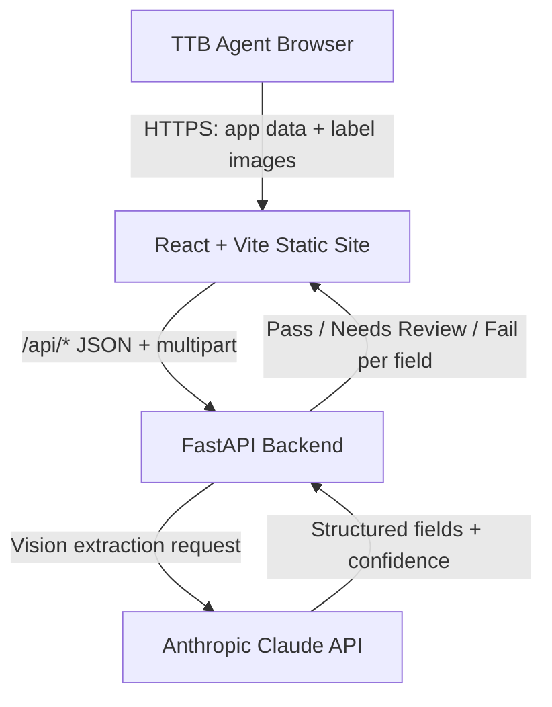

# Technical Architecture

> Generated as part of the code-documentation-governance skill. This document describes the system as implemented in this repository. It is a working reference, not a guarantee of production readiness; see [HANDOFF.md](./HANDOFF.md) for current status and known issues.

## Executive Summary

The TTB Label Compliance Review Tool is a prototype web application that helps TTB compliance agents check whether the text on an alcohol beverage label matches the corresponding COLA application data, and whether mandatory statements (notably the Government Warning) are present and correctly worded.

An agent enters application data and/or uploads label photos. A FastAPI backend sends the image(s) to Claude (vision) to transcribe structured label fields, then applies compliance-aware matching rules and returns a Pass / Needs Review / Fail result per field with a plain-language explanation and CFR citations. The system is stateless: nothing is persisted.

## System Context

- **Primary users:** TTB compliance agents reviewing COLA applications and labels.
- **External systems:** the Anthropic API (Claude vision model) for OCR/field extraction.
- **Hosting:** Render (a backend web service and a static frontend site), defined via a `render.yaml` blueprint.
- **Trust boundaries:** the browser (untrusted user input and uploaded images), the backend service (holds the Anthropic API key), and the Anthropic API (third-party processor of uploaded label images).

## Architecture Diagram

## Major Components

| Component | Responsibility | Technology | Location |
|---|---|---|---|
| Frontend UI | Data entry, image upload, results display, CSV export, COLA template import, Type-Size details view | React + TypeScript + Vite + Tailwind | `frontend/` |
| API client | Calls backend endpoints, retries, cold-start wake, COLA template parser client | TypeScript (`api.ts`, `safeFetch`) | `frontend/src/` |
| API layer | HTTP endpoints, request handling, streaming, prefill routes | FastAPI (`app/main.py`) | `backend/` |
| Pre-fill Engine | CSV/JSON template parsing, normalization of headers and beverage types, demo presets | Python (`app/prefill.py`) | `backend/` |
| Extraction client | Sends images to Claude, parses structured output, image preprocessing | Anthropic SDK (`app/claude_client.py`) | `backend/` |
| Type-Size CV Engine | Scale-marker detection (ID-1 card, ArUco), skew estimation, uppercase glyph segmentation, physical mm measurement (27 CFR 16.22 Option A) | OpenCV (`cv_typesize.py`) + Pillow | `backend/` |
| Compliance engine | Field matching, tolerances, CFR checks, confidence gating, type-size evaluation | Python (`app/compliance.py`) | `backend/` |
| Data models | Request/response schemas, TypeSizeMeasurement models | Pydantic (`app/models.py`) | `backend/` |

## Data Flow

1. The agent enters application data (single or batch) and/or uploads one to four label images per label.
2. The frontend sends the data to the backend via `/api/*` endpoints (JSON plus multipart image uploads). Images are resized client-side (max long edge of 1600px matching backend intent) before upload.
3. The backend passes the image(s) to Claude with an extraction tool schema. When multiple photos have distinct roles (e.g. front/back), each is extracted independently and merged.
4. Claude returns structured fields plus an `extraction_confidence` score (and per-field confidence).
5. The compliance engine gates on confidence, evaluates physical type size via `cv_typesize.py` if scale markers are present, applies statutory matching rules and CFR checks, and produces a Pass / Needs Review / Fail per field.
6. The frontend renders results with side-by-side application-vs-label values, confidence badges, calibrated type size measurement details, a zoomable image viewer, and CSV export for batches.

No application data or images are stored server-side; each request is stateless.

## Control Flow

- **Single review:** one label + application data -> one Claude call -> compliance checks -> result.
- **Batch review:** multiple labels submitted together; a streaming endpoint (`/api/review/batch/stream`, NDJSON) reports per-label progress live.
- **Label-only check:** label image(s) with no application data, validated against TTB mandatory label requirements (27 CFR Parts 4, 5, 7, and 16). When beverage type is ambiguous, the response sets `needs_beverage_confirmation` and the UI prompts the agent to confirm before evaluating.

## Trust Boundaries

- **Browser -> Backend:** all uploaded images and typed data are untrusted input. File type is validated server-side via magic-byte signatures (`_reject_if_not_image`) rather than trusting client MIME types.
- **Backend -> Anthropic API:** label images leave the trust boundary and are processed by a third party. Relevant to privacy and to any outbound-egress firewall constraints noted for production.
- **Secret boundary:** the Anthropic API key lives only in the backend service environment; it is never exposed to the browser.

## Authentication, Rate Limiting, and Guardrails

The prototype implements a **fail-open security and abuse prevention architecture**:

1. **Fail-open demo gate**: When `DEMO_ACCESS_TOKEN` is unset in the environment, all requests proceed normally (dev/eval never locked out). When set, review endpoints require `Authorization: Bearer <token>`. `/api/health` and `/api/demo-info` remain strictly open. No mandatory `API_AUTH_TOKEN` is introduced.
2. **Soft rate limiting**: Inbound IP rate limiting is enforced via `slowapi` on expensive review endpoints (`RATE_LIMIT_REVIEW`, default 20/min). Exceeding limits returns HTTP **429 Too Many Requests** (never 401/403) with `Retry-After` header. `/api/health` and `/api/demo-info` are exempt and unlimited.
3. **Concurrency cap for Claude calls**: A process-wide `asyncio.Semaphore` (`MAX_CONCURRENT_CLAUDE_CALLS`, default 5) wraps all Anthropic API extraction calls with timeout `CLAUDE_CONCURRENCY_TIMEOUT` (default 30.0s), preventing batch floods from overwhelming API limits.
4. **Soft spend / abuse tracking**: `DailySpendGuard` (`MAX_REVIEW_REQUESTS_PER_DAY`) monitors process request volume on Render and emits loud warnings upon exceeding thresholds without blocking evaluator access. Multi-instance setups will use Redis in future iterations.
5. **Image decompression protection**: Pillow `Image.MAX_IMAGE_PIXELS` is explicitly set to 64,000,000 to prevent image bomb DoS attacks.

This is **not** real per-user authentication or authorization: it is designed to keep public demos accessible and safe from abuse. See [REGULATORY_REFERENCES.md](./REGULATORY_REFERENCES.md).

## Configuration

Key environment variables (see [HANDOFF.md](./HANDOFF.md) for the authoritative list):

| Variable | Purpose | Required | Secret? |
|---|---|---|---|
| `ANTHROPIC_API_KEY` | Auth for the Anthropic API (backend only) | Yes | Yes |
| `CLAUDE_MODEL` | Vision-capable Claude model override (default: `claude-sonnet-4-5`) | No | No |
| `USE_FAST_EXTRACTION` | Feature flag to route extractions to faster/cheaper model on -dev (default: `false`) | No | No |
| `EXTRACTION_FAST_MODEL` | Fast model when `USE_FAST_EXTRACTION=true` (default: `claude-3-5-haiku-latest`) | No | No |
| `VITE_API_HOST` | Backend host the frontend calls (build-time) | Yes (frontend) | No |
| `CORS_ORIGINS` | Allowed origins for the backend API | Recommended | No |

`ANTHROPIC_API_KEY` is marked `sync: false` in `render.yaml` and must be set manually in the Render dashboard.

## Deployment Architecture

Deployed on Render via the `render.yaml` blueprint, which defines two services:

- `ttb-label-backend(-dev)` — a Python web service running the FastAPI app.
- `ttb-label-frontend(-dev)` — a static site serving the built React app, wired to the backend via `VITE_API_HOST`.

**Hosting Architecture Decision:** Production uses Render's Starter instance tier for always-on uptime without idle cold-start spin-down delays. Keep-alive pingers are paused/archived. On development/testing instances (Render free tier), the frontend calls `wakeServerIfNeeded()` to warm the backend before submitting.

## Storage Architecture

None. The system is stateless with no database, object storage, or persistent queue. Uploaded images are held only in memory for the duration of a request. A production version handling real COLA data would need to address retention, PII, and document-handling requirements.

## Error Handling

Structured errors and their user-facing messages, causes, and remediation are documented in [ERROR_CODES.md](./ERROR_CODES.md). Notable failure modes include low-confidence extraction (retake-photo prompt), unsupported image formats (e.g. HEIC), and transient upstream errors (HTTP 429/503/529) which the client retries via `safeFetch`.

## Observability

Structured request-timing and latency logging (`RequestTiming`) is implemented across all review endpoints (`/api/review`, `/api/review/batch`, `/api/review/batch/stream`, and `/api/label-check/batch`). Each log entry records JSON payload with:
- `endpoint`: route invoked.
- `wall_time_ms`: total elapsed duration for the request / label review.
- `claude_time_ms`: cumulative latency spent waiting for Claude Vision API extraction.
- `claude_calls`: number of Claude Vision requests made.
- `image_count`: number of images submitted.
- `status`: outcome status (`pass`, `warning`, `fail`, `error`, `done`).

Logs never contain raw image bytes, authorization tokens, or sensitive credentials.

## Security Architecture

- Secrets (Anthropic API key) are confined to the backend environment and excluded from the repo.
- Uploaded images are sent to a third-party API (Anthropic); this should be disclosed to users and reviewed against any outbound-egress policy.
- No authentication/authorization layer exists yet (see above).
- Input validation checks actual image signatures server-side; client-provided MIME types are not trusted.

See [../SECURITY.md](../SECURITY.md) for the vulnerability reporting process.

## Scalability and Performance

A single label review is one Claude API call (no multi-step chains), targeting sub-5-second latency; actual latency depends on the Anthropic API and image size.
Performance optimizations include:
- Concurrent file validation via `asyncio.gather` and offloading CPU-intensive Pillow image operations to `run_in_threadpool`.
- Fast single-pass image enhancement, downscaling (to max 1600px dimension), and JPEG quality 82 compression before transmission to Claude Vision.
- Multi-photo concurrent extraction using `asyncio.gather` for independent panel photos (e.g. front and back) while maintaining field merge semantics.
- Batch processing with streaming (`/api/review/batch/stream`) NDJSON responses to minimize perceived latency for large queues.
- Client-side image resize guard (`ImageDropzone.tsx`) to avoid oversized multi-megabyte payloads over mobile connections.
Throughput is bounded by the Anthropic API and the Render service tier. Batch mode streams per-label results to keep the UI responsive for large batches.

## Architecture Decisions

Key decisions (see [PDR.md](./PDR.md) for fuller rationale):

- Use an LLM (Claude vision) for structured field extraction instead of traditional OCR, to preserve exact casing and infer field roles in a single pass.
- Keep the system stateless for the prototype to avoid PII/retention concerns.
- Make ABV tolerances and confidence thresholds configurable in `compliance.py` rather than hard-coded in logic.

A dedicated `docs/ADR/` directory can be added if formal decision records are desired.

## Known Technical Debt & Future Work

- No real per-user authentication/authorization (a shared-token demo gate is provided for evaluator demos).
- No persistence, distributed tracing, or external metric aggregator (system is intentionally stateless).
- Not integrated with live COLA database (application data is entered manually or imported via CSV/JSON).
- **Standards of Fill (T.D. TTB-200)**: Net contents checks validate against the modernized authorized standards of fill under 27 CFR 4.72 (wine) and 27 CFR 5.203 (distilled spirits) effective January 10, 2025 per Treasury Decision TTB-200 (89 FR 96570), with malt beverages (Part 7) unrestricted.
- **Type Size (27 CFR 16.22 Option A MVP)**: Automated millimeter type-size verification is implemented for calibrated scale markers (ISO/IEC 7810 ID-1 cards, ArUco targets). Uncalibrated photos retain an honest advisory disclosure without invented mm numbers.
- Government Warning wording is validated against the standard statutory text (plus the <= 100 mL short form per 27 CFR 16.21(c)).
- Outbound calls to the Anthropic API may conflict with production egress-firewall restrictions.

## Change Log

| Date | Change | Author |
|---|---|---|
| 2026-07-07 | Initial architecture document created under documentation-governance skill | davejroy |
| 2026-07-08 | Added Related Documentation cross-links; added CONFIGURATION.md and DEPLOYMENT.md references | davejroy |
| 2026-09-09 | Added structured RequestTiming latency logging and concurrent multi-photo extraction documentation | Kilroy_Lives |
| 2026-09-09 | Added field-test documentation suite (`docs/field-tests/`) and synthetic test fixtures for 19 scenarios | Kilroy_Lives |
| 2026-09-16 | Added performance, UX, and simplification analysis (`docs/PERFORMANCE_UX_ANALYSIS.md`) and fixed demo auth header propagation | Kilroy_Lives |
| 2026-09-16 | Added in-app Instructions/Help guide modal (`InstructionsModal.tsx`) and header trigger button | Kilroy_Lives |
| 2026-09-16 | Implemented deterministic brand containment guard, strict GW uppercase casing, structured missing GW failure, TTB-200 standards of fill modernization, and 27 CFR 16.22 honesty advisory | Kilroy_Lives |
| 2026-09-18 | Integrated 27 CFR 16.22 Option A scale marker Computer Vision pipeline, fail-open exception handling, and uncalibrated advisory mode | Kilroy_Lives |
| 2026-09-18 | Implemented COLA application pre-fill MVP with CSV/JSON import and demo presets | Kilroy_Lives |
| 2026-09-18 | Documented 27 CFR 16.22 Option A CV type-size measurement, COLA pre-fill, fail-open rate limiting/concurrency, and always-on Starter hosting decision | Kilroy_Lives |

## Related Documentation

- [ALWAYS_ON_HOSTING.md](./ALWAYS_ON_HOSTING.md) - always-on hosting strategy and Render vs. Homelab comparison.
- [TYPE_SIZE_16_22_DESIGN.md](./TYPE_SIZE_16_22_DESIGN.md) - architectural design for calibrated 27 CFR 16.22 physical type-size verification.
- [ACCEPTANCE_CHECKLIST.md](./field-tests/typesize/ACCEPTANCE_CHECKLIST.md) - field acceptance checklist for calibrated type size verification.
- [PERFORMANCE_UX_ANALYSIS.md](./PERFORMANCE_UX_ANALYSIS.md) - ranked performance, UX, and simplification recommendations matrix.
- [FIELD_TEST_REPORT.md](./field-tests/FIELD_TEST_REPORT.md) - field test results and empirical benchmarks across 19 scenarios on -dev.
- [CONFIGURATION.md](./CONFIGURATION.md) - environment variables and admin-tunable thresholds.
- [DEPLOYMENT.md](./DEPLOYMENT.md) - build, deploy, promotion, and rollback on Render.
- [ERROR_CODES.md](./ERROR_CODES.md) - error codes and troubleshooting.
- [SBOM.md](./SBOM.md) - software bill of materials / dependencies.
- [SECURITY_REVIEW_2026-09-16.md](./SECURITY_REVIEW_2026-09-16.md) - comprehensive defensive security review & prod/dev parity report.
- [SECURITY_REVIEW_OWASP_LLM.md](./SECURITY_REVIEW_OWASP_LLM.md) - OWASP LLM Top 10 review.
- [REGULATORY_REFERENCES.md](./REGULATORY_REFERENCES.md) - TTB/CFR regulatory basis.
- [HANDOFF.md](./HANDOFF.md) - engineering handoff notes.
