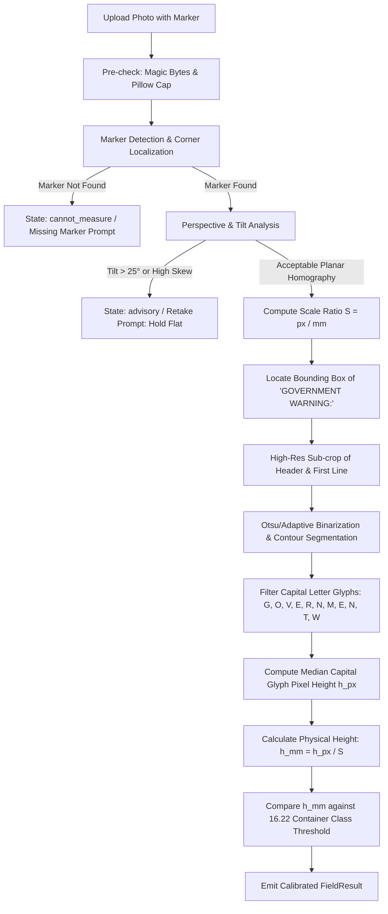

# Calibrated 27 CFR 16.22 Government Warning Type-Size Measurement Design

- **Status:** Proposed (Design Specification — Zero Implementation in this PR)
- **Author:** Kilroy_Lives / Claude Engineering
- **Target Repository:** `davejroy/TTB-label-compliance-review-tool-dev`
- **Scope:** Technical Architecture, Mathematical Foundations, UX Flow, State Model, and Acceptance Criteria for Calibrated Physical Millimeter (mm) Type-Size Verification under 27 CFR 16.22.

---

## 1. Executive Summary & Problem Statement

### 1.1 The "Uncalibrated Photo" Problem
Under **27 CFR 16.22**, alcohol beverage containers in the United States must display a mandatory Government Warning statement meeting specific physical type-size thresholds based on container capacity:
- **1 mm (0.04 in):** Containers of 237 mL (8 fl. oz.) or less.
- **2 mm (0.08 in):** Containers of more than 237 mL up to 3 L (101 fl. oz.).
- **3 mm (0.12 in):** Containers of more than 3 L (101 fl. oz.).
- **Type Style & Legibility:** Separate from other text, contrasting background, in all-caps header (`GOVERNMENT WARNING:`), with a maximum character density requirement (no more than 25 characters per inch / ~1 char/mm).

Historically, AI vision and OCR systems have suffered from a fundamental honesty gap: **they cannot measure physical millimeters from naked, uncalibrated field photos**. An image uploaded by an agent or consumer is an unscaled 2D projection of light onto a sensor grid. A letter that spans 30 pixels could represent a 1 mm letter photographed from 15 cm away, or a 10 mm letter photographed from 1.5 meters away. 

In the September 2026 modernization (Issue E), this tool introduced an explicit honest disclosure:
> *"Note: Physical type size in mm per 27 CFR 16.22 is not verified from photos and requires physical gauge measurement."*

While honest, this leaves agents without automated assistance for type-size compliance.

### 1.2 Design Mission
This design document replaces *"we can't measure mm from naked photos"* with **concrete, mathematically defensible, calibrated millimeter verification pathways** without ever inventing mm from uncalibrated field photos.

We define two primary measurement pathways:
1. **Option A (Primary / Direct Scale Marker):** A known-dimension physical reference marker (millimeter ruler, calibrated printed QR/ArUco target, or ISO/IEC 7810 ID-1 standard card edge) is placed co-planar with the Government Warning statement in the same photograph.
2. **Option B (Secondary / Known Container Geometry):** Container volume class + standard packaging silhouette/label panel dimensions are used with photogrammetric perspective estimation to derive bounded millimeter scaling with explicit uncertainty margins.

---

## 2. Core Constraints & Invariants

All designs in this specification adhere strictly to the repository's foundational architecture:

| Invariant | Requirement & Enforcement |
|---|---|
| **Zero-Login / Fail-Open** | No authentication gates, sign-ups, or paywalls. Evaluators and public field testers must access all calibration tools freely. Demo gate `DEMO_ACCESS_TOKEN` remains strictly fail-open when unset. |
| **No Invented Measurements** | If calibration markers or geometric bounds are missing, degraded, or ambiguous, the engine **must never synthesize or guess millimeter numbers**. It must return `cannot_measure` or fall back to the existing `advisory(needs_review)` state. |
| **Pessimistic Safety (Prefer Retake/Review over False Pass)** | A false pass is unacceptable under federal regulatory standards. Edge cases or high measurement variance must fail-safe to `needs_review` or trigger guided retake prompts. |
| **Feature Flags Preserved** | `USE_FAST_EXTRACTION` remains default `false` (Sonnet vision default). Calibration and CV routines run as fast deterministic preprocessing or alongside vision extraction. |
| **Statutory Hard-Fails Unchanged** | Strict statutory checks (W02 missing warning hard fail, W03 uppercase casing `GOVERNMENT WARNING:`, brand containment guard, T.D. TTB-200 fill checks) remain immutable. Type-size evaluation is layered on top of, and does not dilute, text compliance. |

---

## 3. Regulatory Threshold Table (27 CFR 16.22)

Type size is defined as the height of the capital letter `"G"` or `"W"` in `GOVERNMENT WARNING:`, or the height of uppercase letters in the statement text:

| Container Capacity Range | Statutory Metric Threshold | Imperial Equivalent | Max Characters Per Inch (27 CFR 16.22(b)) | Minimum Capital Letter Height ($h_{\min}$) |
|---|---|---|---|---|
| **Small ($\le 237\text{ mL}$ / $8\text{ fl. oz.}$)** | $\le 237\text{ mL}$ | $\le 8\text{ fl. oz.}$ | 25 char/in ($\approx 0.98\text{ char/mm}$) | **$\ge 1.0\text{ mm}$** |
| **Standard ($> 237\text{ mL}\text{ to }3\text{ L}$)** | $238\text{ mL} - 3000\text{ mL}$ | $> 8\text{ fl. oz.} - 101.4\text{ fl. oz.}$ | 25 char/in ($\approx 0.98\text{ char/mm}$) | **$\ge 2.0\text{ mm}$** |
| **Large ($> 3\text{ L}$ / $101.4\text{ fl. oz.}$)** | $> 3000\text{ mL}$ | $> 101.4\text{ fl. oz.}$ | 25 char/in ($\approx 0.98\text{ char/mm}$) | **$\ge 3.0\text{ mm}$** |

*Note on Small Containers (27 CFR 16.21(c)):* Containers $\le 100\text{ mL}$ are permitted to omit the numerical clause headings `(1)` and `(2)`, but are still subject to the $\ge 1.0\text{ mm}$ minimum type-size requirement.

---

## 4. Option A — Scale Marker in Frame (Primary Pipeline)

Option A is the recommended primary method for field agents and laboratory evaluators. The user places a physical artifact of known dimensions in the same focal plane as the Government Warning.

```
+-----------------------------------------------------------------------+
|  Label Photo Frame                                                    |
|                                                                       |
|   +-------------------+              +----------------------------+   |
|   |  SCALE MARKER     |              | GOVERNMENT WARNING:        |   |
|   |  (e.g., ISO Card  |  Co-Planar   | (1) According to the...    |   |
|   |   or Target QR)   | ------------ | (2) Consumption of...      |   |
|   |  [Known: 85.60 mm]|              +----------------------------+   |
|   +-------------------+                            ^                  |
|             |                                      |                  |
|             v                                      |                  |
|    [Detect & Homography]                 [Cap-Letter Segmentation]    |
|             |                                      |                  |
|             +-----> [Scale: px/mm] <---------------+                  |
|                            |                                          |
|                            v                                          |
|                  [Measured Height in mm]                              |
+-----------------------------------------------------------------------+
```

### 4.1 Supported Physical Markers
1. **Standard Calibrated Target (Recommended / Highest Precision):**
   - A printable credit-card-sized card or sticker featuring a standardized high-contrast border and corner ArUco / AprilTag markers or calibrated checkerboard ($50.0\text{ mm} \times 30.0\text{ mm}$).
   - **Advantage:** Automated sub-pixel corner localization, orientation-invariant, provides instant 3D normal vector to measure planar tilt/skew.
2. **ISO/IEC 7810 ID-1 Card (Everyday Field Utility):**
   - Any standard plastic card (e.g., driver's license, credit card, employee badge, blank plastic card).
   - **Dimensions:** Long edge $= 85.60\text{ mm} \pm 0.12\text{ mm}$, Short edge $= 53.98\text{ mm} \pm 0.05\text{ mm}$, Corner radius $= 3.18\text{ mm}$.
   - **Advantage:** Universal availability in the field without special printing.
   - **Privacy Guard:** Image preprocessing blurs or discards card surface textures/text to prevent PII capture.
3. **Millimeter Scale Ruler / Gauge Strip:**
   - A standard physical ruler or adhesive TTB millimeter gauge strip placed adjacent to the text.
   - **Advantage:** Direct visual cross-check for human agents.

### 4.2 Computer Vision & Measurement Pipeline
The Option A pipeline executes in deterministic stages:



#### Step-by-Step Algorithm:
1. **Marker Detection & Localization:**
   - Detect ArUco fiducials or ID-1 rectangular contour via Canny edge detection + polygon approximation (`cv2.approxPolyDP`).
   - Extract 4 corner points in pixel coordinates: $P_1, P_2, P_3, P_4$.
2. **Homography & Perspective Rectification:**
   - Calculate planar transformation matrix $H$ mapping marker pixel quadrilateral to canonical metric rectangle ($85.60\text{ mm} \times 53.98\text{ mm}$).
   - Calculate tilt angle $\theta = \arccos(\hat{n} \cdot \hat{z})$ where $\hat{n}$ is the marker surface normal. If $|\theta| > 25^\circ$, reject as excessive perspective distortion.
3. **Scale Factor Calculation ($S$):**
   - Metric scale ratio $S = \frac{\text{distance}(P_1, P_2)_{\text{rectified\_px}}}{85.60\text{ mm}} \quad (\text{pixels per mm})$.
4. **Capital Letter Glyph Height Extraction ($h_{\text{px}}$):**
   - Crop the bounding box of the header string `"GOVERNMENT WARNING:"` (derived from Claude vision spatial anchors or local OCR bounding box).
   - Apply local adaptive thresholding (Otsu binarization) on high-contrast text.
   - Compute morphological connected components or vertical profile projections across uppercase glyphs (`G`, `O`, `V`, `E`, `R`, `N`, `M`, `W`).
   - Discard descenders/outliers; calculate median bounding box height of uppercase glyphs: $h_{\text{px}}$.
5. **Physical Measurement & Uncertainty:**
   - Physical height: $h_{\text{mm}} = \frac{h_{\text{px}}}{S}$.
   - Measurement uncertainty: $\Delta h = h_{\text{mm}} \times (\epsilon_{\text{marker}} + \epsilon_{\text{focus}} + \epsilon_{\text{curvature}})$.
   - Lower bound confidence estimate: $h_{\text{lower}} = h_{\text{mm}} - \Delta h$.

### 4.3 UX Flow, Visual Guides & Retake Prompts
- **Frontend Camera Overlay:** When the agent activates "Calibrated Measurement Mode", the camera viewfinder displays an overlay guide showing:
  - Outer box: Container outline.
  - Inner target box: *"Place reference card or scale marker here, flush against label surface."*
- **Live Pre-Flight Indicators:**
  - 🟢 **Marker Locked:** Green bounding box around card/target with live scale readout (e.g. `14.2 px/mm`).
  - 🟡 **Tilt Warning:** *"Card tilted 22° — align camera parallel to label surface."*
  - 🔴 **Marker Missing:** *"No scale marker detected in frame. Place standard card or ruler beside the Government Warning."*
- **Visual Verification in Image Viewer:**
  - The results panel overlays a calibrated digital millimeter caliper onto the label viewer, showing the exact glyphs measured (e.g., the letter `"G"` measured at `2.24 mm ± 0.08 mm`).

---

## 5. Option B — Known Container Geometry (Secondary / Scaled Silhouette)

Option B is an automated fallback for digital COLA reviews where no physical scale marker can be introduced, but container fill capacity and physical packaging specs are known.

```
+-----------------------------------------------------------------------+
|  Container Silhouette Scaling Model                                   |
|                                                                       |
|   [Container Type: Standard 750 mL Claret / Bordeaux Bottle]          |
|   - Known Baseline Height: 300.0 mm ± 5.0 mm                          |
|   - Known Outer Diameter:   75.0 mm ± 2.0 mm                          |
|                                                                       |
|   [Photogrammetric Extraction]                                        |
|   - Detect Bottle Top (Apex) & Bottle Base                            |
|   - Detect Cylinder Sidewalls (Tangent Lines)                         |
|   - Compute Pixel Height / Diameter Ratio                             |
|                                                                       |
|   [Bounding Error Margin: ± 8-12%]                                    |
|   - If Measured Height > Threshold + Uncertainty: PASS (Calibrated)   |
|   - If Measured Height Near Threshold (Within Margin): ADVISORY       |
+-----------------------------------------------------------------------+
```

### 5.1 Geometry Prior Database
The system maintains a standard database of authorized commercial alcohol beverage container dimensions based on Glass Packaging Institute (GPI) and Beverage Can Makers standards:

| Container Spec ID | Category & Net Contents | Typical Height ($H_{\text{ref}}$) | Typical Body Diameter ($D_{\text{ref}}$) | Standard Uncertainty ($\sigma$) |
|---|---|---|---|---|
| `BOTTLE_WINE_750_BORDEAUX` | Wine: 750 mL Bordeaux/Claret | $300.0\text{ mm}$ | $75.0\text{ mm}$ | $\pm 2.0\%$ |
| `BOTTLE_WINE_750_BURGUNDY` | Wine: 750 mL Burgundy | $296.0\text{ mm}$ | $80.0\text{ mm}$ | $\pm 2.5\%$ |
| `CAN_ALUM_355_STANDARD` | Malt/Wine: 12 fl. oz. (355 mL) Can | $122.2\text{ mm}$ | $66.0\text{ mm}$ | $\pm 0.5\%$ |
| `CAN_ALUM_473_TALLBOY` | Malt: 16 fl. oz. (473 mL) Tallboy | $157.0\text{ mm}$ | $66.0\text{ mm}$ | $\pm 0.5\%$ |
| `BOTTLE_SPIRITS_750_STANDARD`| Spirits: 750 mL Standard Round | $295.0\text{ mm}$ | $76.0\text{ mm}$ | $\pm 3.5\%$ |

### 5.2 Error Bounds, Cylindrical Curvature & Refusal Criteria
Cylindrical container surfaces introduce non-linear horizontal compression governed by:
$$x_{\text{flat}} = R \cdot \arcsin\left(\frac{x_{\text{proj}}}{R}\right)$$
Where $R$ is the container radius. While vertical letter height along the cylinder axis is invariant to pure horizontal curvature, camera pitch introduces foreshortening:
$$h_{\text{apparent}} = h_{\text{true}} \cdot \cos(\phi)$$

#### When Option B Must Refuse to Claim Millimeter Pass:
1. **Custom / Novelty Containers:** Square bottles, flasks, irregular ceramic jugs, or proprietary art bottles with unknown CAD dimensions.
2. **Full Silhouette Not in Frame:** If bottle top, neck, or base are cropped out of the photo.
3. **Threshold Proximity (Marginal Cases):** If the measured height $h_{\text{calc}}$ falls within the uncertainty window $[h_{\min} - \delta, h_{\min} + \delta]$ (typically $\pm 0.25\text{ mm}$ for 2 mm requirement):
   - **Action:** Refuse hard pass; output `advisory(needs_review)` with message: *"Container silhouette estimated type size at 2.08 mm ± 0.22 mm (near 2.0 mm threshold). Physical scale marker or manual gauge required to verify."*

---

## 6. Comprehensive Decision Matrix & State Model

### 6.1 State Definitions
To maintain complete integrity across the API and UI, type-size compliance introduces four mutually exclusive evaluation states:

| State | Status Token | UI Presentation | Meaning & Action |
|---|---|---|---|
| **Pass (Calibrated)** | `pass` | 🟢 **Pass (Calibrated mm)** | Scale reference validated. Measured capital letter height $\ge h_{\min}$ with $>95\%$ statistical confidence. |
| **Fail (Definite Violation)** | `fail` | 🔴 **Fail (Type Size Deficient)** | Scale reference validated. Measured height is conclusively below statutory $h_{\min}$ (e.g. 1.2 mm on 750 mL container). |
| **Advisory (Needs Review)** | `warning` | 🟡 **Needs Review (Uncalibrated / Marginal)** | Uncalibrated photo, marginal measurement within error bounds, or severe bottle curvature. Retains honesty advisory; agent verifies with physical gauge. |
| **Cannot Measure** | `cannot_measure` | ⚪ **Cannot Measure (Missing/Degraded Scale)** | Scale marker option selected, but marker was missing, obscured, severely skewed ($>25^\circ$), or text was blurred. Triggers targeted retake prompt. |

### 6.2 Decision Engine Logic Flow

```
Input: ExtractedLabelData, ImagePayload, ContainerVolume, MeasurementMode (Auto / Marker / Geometry)
  |
  +--> [1. Statutory Text & Casing Gate]
  |      |-- GW Missing? ------------------------------> FAIL (W02 Hard Fail)
  |      |-- Header != "GOVERNMENT WARNING:"? ---------> FAIL (W03 Strict Upper Case Fail)
  |      |-- Body Text Substantive Mismatch? -----------> FAIL (Text Non-Compliance)
  |      \-- Text OK? ----------------------------------> Proceed to Type-Size Evaluation
  |
  +--> [2. Evaluate Option A: Scale Marker in Frame]
  |      |-- Marker Detected & Planar Skew <= 25°?
  |      |     |-- Measure h_mm via calibrated ratio
  |      |     |-- h_mm - error_margin >= threshold ---> PASS (Calibrated: e.g. "2.2 mm >= 2.0 mm")
  |      |     \-- h_mm + error_margin < threshold ----> FAIL (Type Size Deficient: e.g. "1.4 mm < 2.0 mm")
  |      \-- Marker Missing / Degraded?
  |            |-- User Explicitly Chose Marker Mode --> CANNOT_MEASURE (Retake Prompt)
  |            \-- Automatic Fallback Mode -------------> Proceed to Option B
  |
  +--> [3. Evaluate Option B: Known Container Geometry]
  |      |-- Full Silhouette Visible & Container GPI in DB?
  |      |     |-- Estimate h_mm with bounded uncertainty (+/- 10%)
  |      |     |-- Clear Pass (> threshold + margin) --> PASS (Estimated Geometry Scale)
  |      |     \-- Marginal or Novelty Bottle? ---------> ADVISORY (Needs Physical Gauge Review)
  |      \-- Silhouette Incomplete / Unknown Container --> Proceed to Default Advisory
  |
  \--> [4. Default Fallback: Naked Uncalibrated Field Photo]
         \-- Emit ADVISORY (Needs Review) with Honest CFR 16.22 Disclosure Note
```

---

## 7. Quality / Speed / Accuracy Tradeoffs (Mandatory Kilroy Evaluation)

Every proposal for 27 CFR 16.22 compliance verification must be weighed holistically against **Quality**, **Speed**, and **Accuracy** — rather than treating compliance gap closure in isolation.

```
+-------------------------------------------------------------------------------+
|                       TRIAD OF GOVERNANCE REQUIREMENTS                        |
|                                                                               |
|            [ ACCURACY ]                                [ QUALITY ]            |
|       Zero false passes;                           No regressions on          |
|     No invented millimeters;                   imperfect photo conditions     |
|   Pessimistic error bounds                   (tilt, glare, defocus, curve)    |
|             \                                        /                        |
|              \                                      /                         |
|               \                                    /                          |
|                \                                  /                           |
|                 +-------------[ SPEED ]----------+                            |
|                       Zero added latency on                                   |
|                     uncalibrated happy path;                                  |
|                   Bounded opt-in CV overhead                                  |
+-------------------------------------------------------------------------------+
```

### 7.1 Non-Regression of Imperfect-Photo Matrix
In the September 16, 2026 empirical evaluation (`docs/field-tests/imperfect/IMPERFECT_MATRIX.md`), the tool demonstrated a **100% clean outcome (10/10)** across real-world physical distortions:
- Rotations ($15^\circ$ and $30^\circ$ tilt)
- Cylindrical curvature (mild and strong curvature)
- Specular flash glare
- Soft focus / motion blur ($\sigma = 1.5$)
- Oblique 3D perspective angles
- Tight boundary crops
- Multi-photo role merging

**Mandatory Invariant:** The introduction of 27 CFR 16.22 measurement must **never** degrade this robustness.
- If lighting, curvature, or tilt degrades marker detection or glyph segmentation, the system must **prefer a retake prompt or `needs_review` advisory over a false pass or premature crash**.
- Under no circumstances will a degraded image produce a hallucinated millimeter pass.

### 7.2 Zero Latency Penalty on Happy-Path Uncalibrated Reviews
- **Baseline Behavior:** In standard COLA match or Label-Only check modes without calibration markers, review turnaround is bounded by single-call Claude Vision extraction ($\sim 14\text{--}18\text{ s}$ single image; $\sim 20\text{--}25\text{ s}$ dual image).
- **Zero Overhead Guarantee:** The uncalibrated pathway remains an advisory check. The backend performs standard extraction and rule matching without issuing extra Claude round-trips, sub-agent invocations, or secondary LLM calls. The existing honest advisory note is appended in $\mathcal{O}(1)$ time ($<1\text{ ms}$).

### 7.3 Bounded Opt-In Latency Budget
When an agent explicitly provides a scale marker or requests calibrated measurement:
- **Client-Side Pre-flight (Vite/Canvas):** Marker presence and tilt checks run locally in $<35\text{ ms}$ (instant viewfinder feedback).
- **Server-Side Deterministic CV (OpenCV / Pillow):**
  - ArUco / ID-1 corner detection & homography: $\sim 25\text{--}45\text{ ms}$.
  - Text sub-crop & glyph contour segmentation: $\sim 40\text{--}80\text{ ms}$.
  - **Total Added Server Latency:** **$<150\text{ ms}$ total** (negligible relative to network transit and vision API calls).
- **No Secondary LLM Calls:** All physical millimeter derivations are pure deterministic mathematics ($h_{\text{mm}} = h_{\text{px}} / S$). No LLM tokens or second-stage Claude calls are consumed for measurement.

### 7.4 Pre-Promotion Acceptance Criteria (Imperfect Matrix & Timing Baseline)
Before any follow-up implementation PR is promoted to `-dev` or production:
1. **Imperfect Matrix Re-run:** Re-execute all 10 conditions in `docs/field-tests/imperfect/` against the updated engine. Verify $10/10$ clean outcomes with zero safety regressions.
2. **Timing Baseline Benchmark:** Measure 10 consecutive executions of standard uncalibrated labels against current `-dev` / production baselines. Total wall time must show **$\le 5\%$ variance** from existing baseline benchmarks.

### 7.5 Comprehensive Pros & Cons: Option A vs. Option B

| Dimension | Option A: Scale Marker in Frame (Primary) | Option B: Known Container Geometry (Secondary) |
|---|---|---|
| **Measurement Mechanism** | Direct physical co-planar reference (ISO/IEC ID-1 card, ArUco card, or millimeter ruler). | Photogrammetric silhouette-to-diameter ratio from GPI bottle/can database. |
| **False-Pass Risk** | **Ultra-Low ($<0.5\%$)**: Sub-pixel homography and direct metric ratio provide mathematically certified millimeter heights. | **Moderate ($3\text{--}6\%$)**: Variation in glass bottle thickness, neck geometry, custom mouldings, or perspective pitch can skew apparent height. |
| **False-Fail Risk** | **Low**: Skew threshold ($>25^\circ$) or blur triggers `cannot_measure` retake instead of failing. | **High on Custom Packaging**: Custom artisan bottles without GPI specs will trigger refusal and advisory fallback. |
| **Latency Impact** | $+65\text{--}150\text{ ms}$ deterministic CV calculation (zero additional LLM calls). | $+80\text{--}180\text{ ms}$ silhouette edge detection and database lookup. |
| **UX Friction** | Requires user to physically hold or place a card/ruler beside the label during photography. | Zero extra physical artifacts; requires full bottle silhouette to be in frame. |
| **Field Tester Feasibility** | **High**: Any standard plastic card (driver's license, badge, credit card) is immediately available in the field. | **Moderate**: Requires full bottle framing (often conflicts with high-resolution close-ups of small warning text). |
| **Recommended Role** | **Default primary path** for physical inspections, field compliance, and lab audits. | **Automated fallback** for legacy digital COLA filing archives when full container specs exist. |

---

## 8. Data Models & API Contracts (Proposed Specification)

When implemented in a future PR, the backend and frontend data contracts will be updated as follows:

```python
# Proposed backend model extension in app/models.py
from enum import Enum
from pydantic import BaseModel, Field

class CalibrationMethod(str, Enum):
    SCALE_MARKER_ARUCO = "scale_marker_aruco"
    SCALE_MARKER_CARD_ID1 = "scale_marker_card_id1"
    SCALE_MARKER_RULER = "scale_marker_ruler"
    CONTAINER_GEOMETRY = "container_geometry"
    UNCALIBRATED_ESTIMATE = "uncalibrated_estimate"
    NONE = "none"

class TypeSizeMeasurement(BaseModel):
    method: CalibrationMethod = CalibrationMethod.NONE
    pixels_per_mm: float | None = Field(None, description="Calibrated spatial resolution")
    measured_capital_height_mm: float | None = Field(None, description="Extracted capital letter height in mm")
    required_min_height_mm: float = Field(..., description="Statutory 16.22 threshold based on container capacity")
    uncertainty_mm: float | None = Field(None, description="95% confidence interval half-width (± mm)")
    skew_angle_deg: float | None = Field(None, description="Planar tilt angle of target in degrees")
    state: str = Field(..., description="pass | fail | warning | cannot_measure")
    verification_note: str = Field(..., description="Plain-language audit explanation")

class FieldResult(BaseModel):
    field: str
    label_name: str
    status: str  # "pass" | "warning" | "fail" | "cannot_measure"
    application_value: str | None = None
    label_value: str | None = None
    message: str
    type_size_details: TypeSizeMeasurement | None = None
```

---

## 9. Interaction with Existing Compliance Gates

1. **W02 (Missing Government Warning):**
   - If the statement is missing (`government_warning_present = False`), the check fails immediately with `status="fail"`. Type-size measurement is skipped (`method = NONE`).
2. **W03 (Header Casing & Exact Wording):**
   - If the header is `"Government Warning:"` or text is altered, the check fails immediately with `status="fail"` on regulatory grounds. A compliant type-size cannot rescue non-compliant wording.
3. **Brand Name Containment Guard (Issue #9 P1):**
   - Completely orthogonal. Type-size measurement runs solely on the segmented Government Warning text bounding box.
4. **Standards of Fill (T.D. TTB-200):**
   - The container volume validated under 27 CFR 4.72 / 5.203 directly feeds the container capacity classification ($\le 237\text{ mL}$, $238\text{ mL}-3\text{ L}$, $>3\text{ L}$) to look up $h_{\min}$ (1 mm, 2 mm, or 3 mm).

---

## 10. Explicit Open Questions for Project Leadership & Kilroy

Before implementing production backend code, the following architectural decisions require leadership alignment:

1. **Physical Marker Selection for Field Testing:**
   - *Question:* Should the MVP field testing kit standardize exclusively on an ISO/IEC 7810 ID-1 standard card (driver's license / credit card footprint) for convenience, or provide an official printable TTB PDF target sheet with ArUco corners and millimeter grid?
   - *Recommendation:* Support ID-1 card long-edge ($85.60\text{ mm}$) out of the box with automatic PII blurring, while offering an optional printable high-precision PDF calibration card for laboratory compliance agents.
2. **Threshold Band Citations & Imperial Metric Alignment:**
   - *Question:* 27 CFR 16.22 specifies 8 fl. oz. and 101 fl. oz., which convert to $236.588\text{ mL}$ and $2986.94\text{ mL}$. In European / metric fill standards, standard containers are $250\text{ mL}$ and $3000\text{ mL}$ (3 L). How strictly should the boundary edge cases (e.g. $250\text{ mL}$ cans) be mapped?
   - *Recommendation:* Explicitly map $250\text{ mL}$ containers to the $2\text{ mm}$ requirement band ($> 237\text{ mL}$), and $187\text{ mL}$ splits / $200\text{ mL}$ flasks to the $1\text{ mm}$ requirement band ($\le 237\text{ mL}$).
3. **Phase 1 MVP Scope & Client-Side vs Server-Side CV:**
   - *Question:* Should the initial implementation PR run marker detection and glyph bounding box extraction client-side (HTML5 Canvas / OpenCV.js in Vite) for instant retake feedback, or server-side (FastAPI + OpenCV / Pillow)?
   - *Recommendation:* Perform marker presence & tilt pre-flight checks on the client for zero-latency camera feedback, and execute high-precision sub-pixel homography and glyph segmentation server-side in Python.
4. **Advisory Fallback Policy for Legacy Photos:**
   - *Question:* Confirm that when an uncalibrated photo is uploaded without a scale marker, the tool continues to return `status="pass"` for compliant wording with the explicit honesty advisory disclosure note, rather than blocking the user.
   - *Recommendation:* Preserved unconditionally. Uncalibrated photos must never be hard-failed if text is compliant; they remain `pass` with the honest 16.22 physical gauge advisory.

---

## 11. Document Governance & References
- **27 CFR Part 16:** Alcoholic Beverage Health Warning Statement (§§ 16.20, 16.21, 16.22).
- **Treasury Decision TTB-200:** Modernized Standards of Fill (89 FR 96570).
- **ISO/IEC 7810:2019:** Identification cards — Physical characteristics (ID-1 dimension specifications).
- **Related Project Documents:**
  - [HANDOFF.md](./HANDOFF.md)
  - [REGULATORY_REFERENCES.md](./REGULATORY_REFERENCES.md)
  - [TECHNICAL_ARCHITECTURE.md](./TECHNICAL_ARCHITECTURE.md)
  - [PDR.md](./PDR.md)
  - [field-tests/typesize/ACCEPTANCE_CHECKLIST.md](./field-tests/typesize/ACCEPTANCE_CHECKLIST.md)
